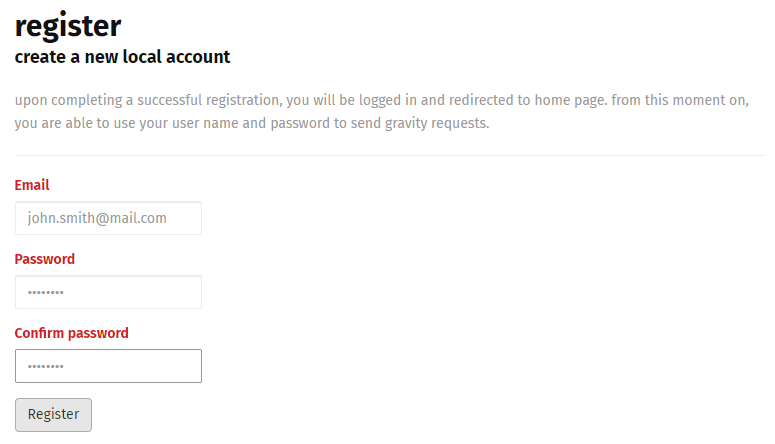

# Create a Free Rhino API Account
2 min · Unit · [Roei Sabag](https://www.linkedin.com/in/roei-sabag-247aa18/) · Level ★☆☆☆☆

Rhino API is an open source premium service. Rhino have a free, lifetime access without features or users limitation with a monthly runtime of 10 hours per registration. This runtime is automatically renew every month. If you want **an unlimited access, please check our open source support** or contact us at <rhino.api@gmail.com> for an enterprise plan.

## We Love Open Source
If you have an open source project, you can apply for a free, lifetime (evaluated yearly) Rhino account without any runtime or features limitation. Send your application request to <rhino.api@gmail.com>. Please include in your mail.

1. Your full name.
2. Your role (e.g. developer, QA automation, etc.).
3. _**Rhino User Name**_.
4. Link to your open source project. 

## Create a Free Account
> Rhino user is email formatted. That means you do not need to provide a real email (no email verification), as long as the user name you choose is a standard email phrase.  

In order to execute your plugins using Gravity/Rhino API, you need to create an account which identifies you. You need to provide an email and setting your password, which later will be used when you send Gravity/Rhino requests.

1. [Navigate to Gravity/Rhino API Registration Page](https://g-api.azurewebsites.net/Identity/Account/Register)
2. Fill in the email you wish to register with.
3. Set your password.
4. Validate your password.
5. Click on `Register` button.

  
_**Rhino API Register Panel**_
