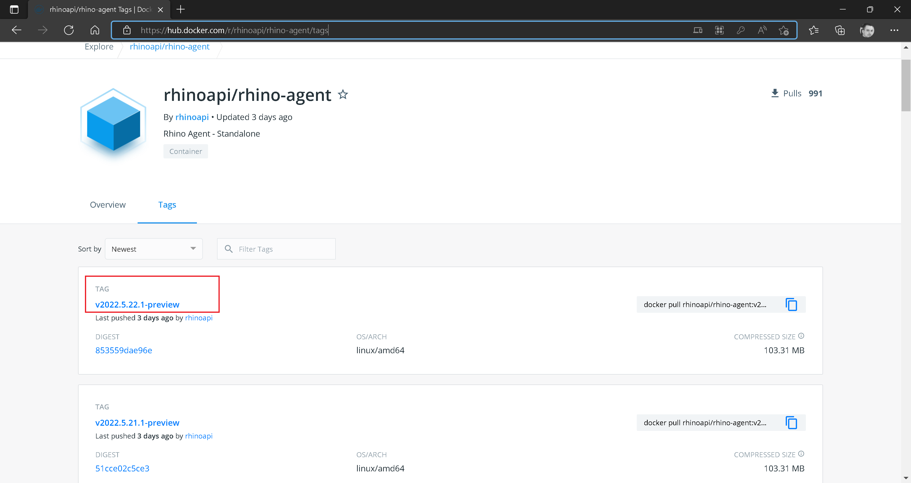

# Rhino API Deployment - Docker

:arrow_backward: [Previous](./02.DeploymentProcessHost.md) Unit 3 of 6 [Next](./04.DeploymentIIS.md) :arrow_forward:

5 min · Unit · [Roei Sabag](https://www.linkedin.com/in/roei-sabag-247aa18/) · Level ★☆☆☆☆  

> :information_source: **Information**
>  
> `Docker Engine` must be installed and running. For more information about how to download and install Docker Engine check [https://docs.docker.com/engine/install/](https://docs.docker.com/engine/install/).

## Pull Docker Image & Deploy Docker Container

1. Get the latest version from Rhino API [DockerHub Tags Page](https://hub.docker.com/r/rhinoapi/rhino-agent/tags).  

  
_**image 1.1 - DockerHub Tags Page**_  

1. Run the following command from a command shell (bash, CMD, etc.) - You need to add the tag from [DockerHub Tags Page](https://hub.docker.com/r/rhinoapi/rhino-agent/tags) after `rhinoapi/rhino-agent` separated by `:`.

```bash
docker run -p 9000:9000 -p 9001:9001 rhinoapi/rhino-agent:v2022.5.22.1-preview
```  

The following is expected:  

```bash
Now listening on: https://localhost:9001
Now listening on: http://localhost:9000
Application started. Press Ctrl+C to shut down.
```  

### Next Unit: Rhino API Deployment - Internet Information Services (IIS)

[Continue](./04.DeploymentIIS.md) :arrow_forward:
