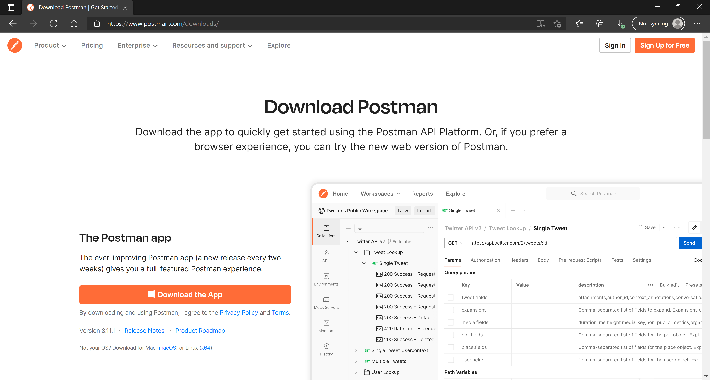

:arrow_backward: [Previous](./02.InstallRhinoLanguageExtension.md) Unit 3 of 10 [Next](./04.InstallNodeJs.md) :arrow_forward:

# Install Postman
2 min · Unit · [Roei Sabag](https://www.linkedin.com/in/roei-sabag-247aa18/) · Level ★☆☆☆☆

Postman is an API platform for building and using APIs.
  
## Installation
1. Navigate to [https://www.postman.com/downloads/](https://www.postman.com/downloads/)
2. Download the Postman Application suitable for your operating system.
3. Run the installation file.
4. Follow the installation instructions (if any) provided by Postman.

  
_**image 1.1 - Postman Download Page**_

---
### Next Unit: Install Node.js
### [Continue](./04.InstallNodeJs.md) :arrow_forward:
---