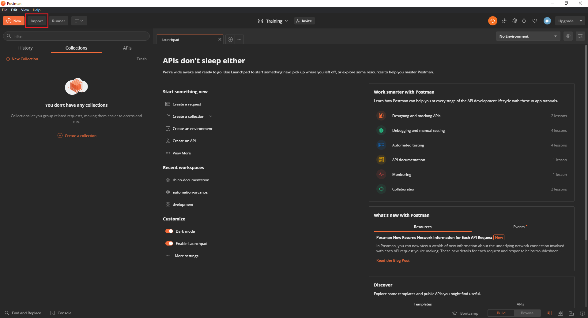
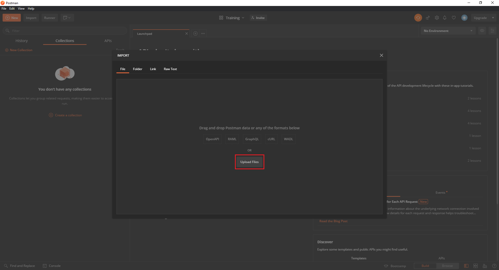
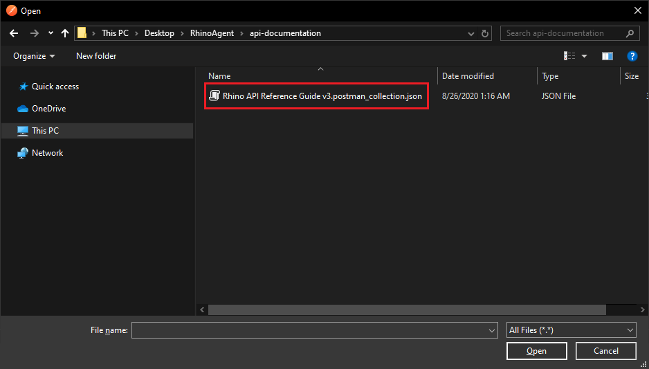
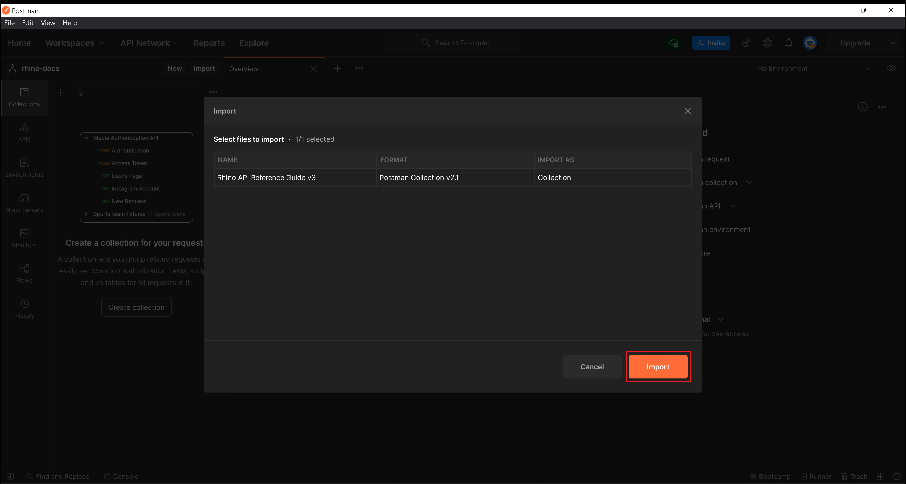
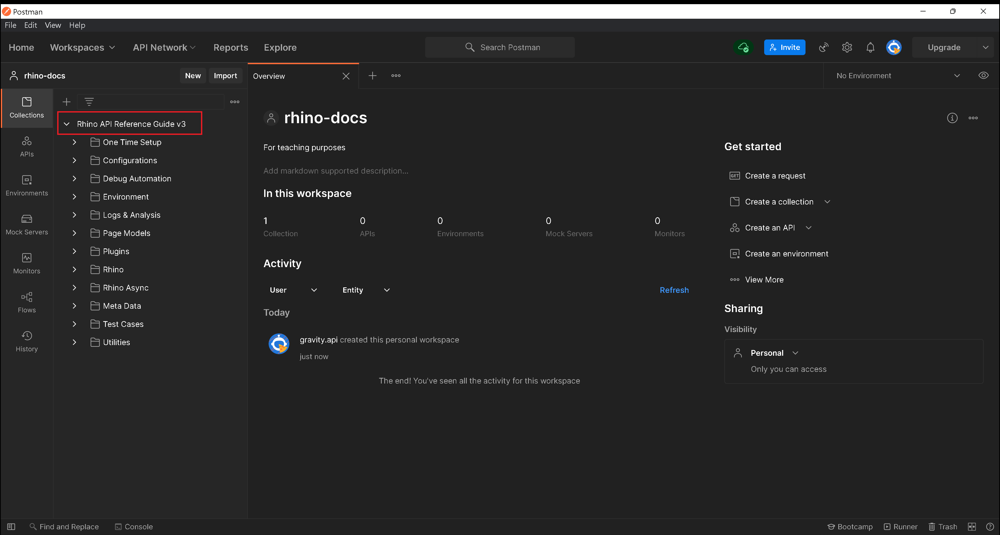
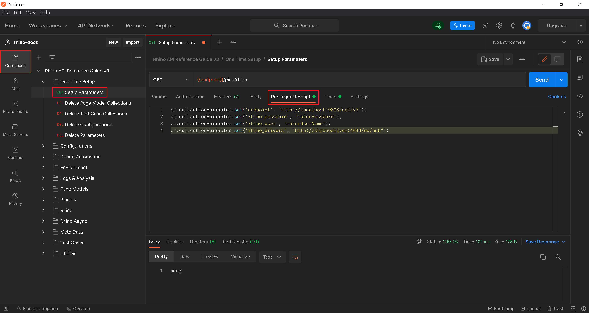
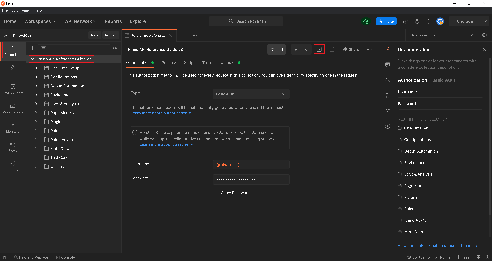
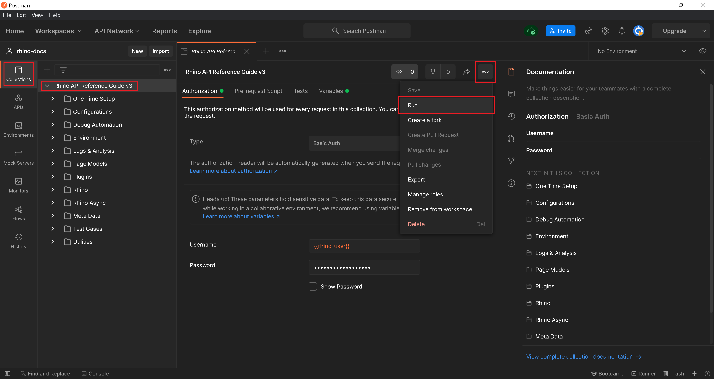
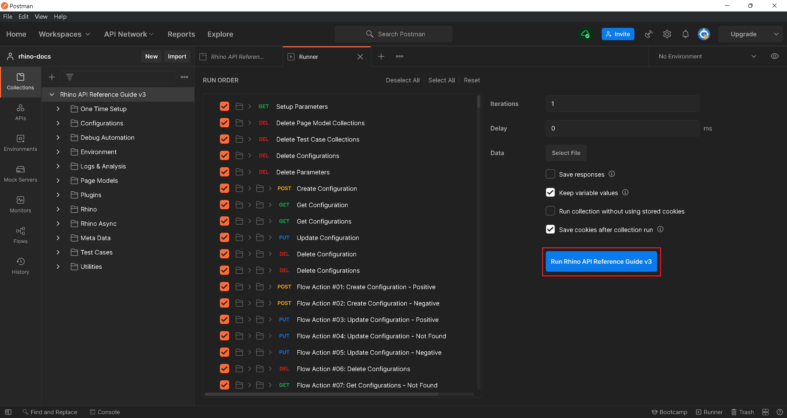
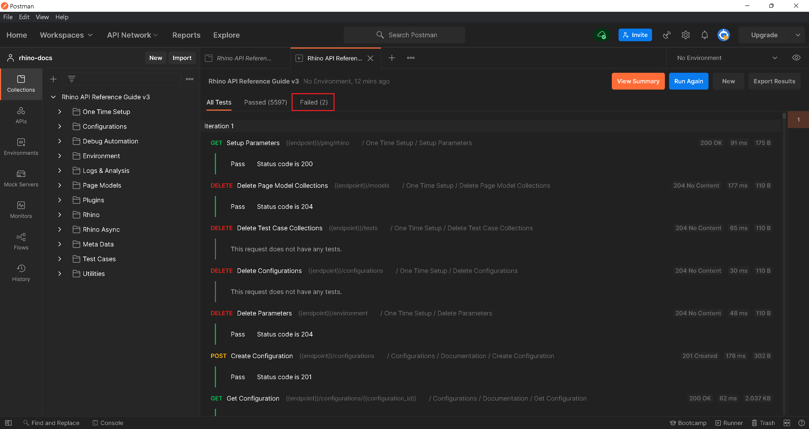

# Rhino Health Check

:arrow_backward: [Previous](./08.SutDeployment.md) Unit 9 of 10 [Next](./10.Summary.md) :arrow_forward:

30 min · Unit · [Roei Sabag](https://www.linkedin.com/in/roei-sabag-247aa18/) · Level ★★☆☆☆

> :information_source: **Information**
>  
> This is an optional process and can be skipped if you already know that Rhino is correctly deployed.
>  
> :warning: **Warning**
>  
> Some of the tests requires a connection to the outside world. If you are running in an isolated environment without a connection, these tests will fail but if all other tests have passed, you can ignore these failed tests.
  
## Copy Rhino Health Check Postman's Collection File

1. Create a folder `C:\DockerVolumes\Rhino\ApiDocumentation` on windows or `/usr/DockerVolumes/Rhino/ApiDocumentation` on Linux/Mac OS.
2. Run the command:  

```bash
docker ps
```  

The result looks like this (the `CONTAINER ID` might be different):  

```cmd
CONTAINER ID   IMAGE                                         COMMAND                  CREATED       STATUS       PORTS                                                           NAMES
22b73340784c   selenium/standalone-chrome:3.141.59-dubnium   "/opt/bin/entry_poin…"   5 hours ago   Up 5 hours   0.0.0.0:4444->4444/tcp, :::4444->4444/tcp                       build_chromedriver_1
7016d4231187   rhinoapi/rhino-agent:latest                   "dotnet Rhino.Agent.…"   5 hours ago   Up 5 hours   0.0.0.0:9000-9001->9000-9001/tcp, :::9000-9001->9000-9001/tcp   build_rhino_1
6ed27572d176   openproject/community:11                      "./docker/prod/entry…"   5 hours ago   Up 5 hours   5432/tcp, 0.0.0.0:8080->80/tcp, :::8080->80/tcp                 build_openproject_1
```  

### Windows

```cmd
docker cp 7016d4231187:"/app/ApiDocumentation/Rhino API Reference Guide v3.postman_collection.json" C:\DockerVolumes\Rhino\ApiDocumentation
```  

### Linux/Mac

```cmd
docker cp 7016d4231187:"/app/ApiDocumentation/Rhino API Reference Guide v3.postman_collection.json" /usr/DockerVolumes/Rhino/ApiDocumentation
```

The id after `docker cp` command (`7016d4231187`) is the `CONTAINER ID` of `rhinoapi/rhino-agent:latest` listed once you have run the `docker ps` command.

## Import Rhino API Documentation

1. Open `Postman` application.
2. Click on `Import` button.  

  
_**image 1.1 - Postman Import Button**_  

1. Click on `Upload File` button under `IMPORT` dialog.  

  
_**image 1.2 - Upload File**_  

1. Select the file `Rhino API Reference Guide v3.postman_collection.json` under `C:\DockerVolumes\Rhino\ApiDocumentation` on windows or `/usr/DockerVolumes/Rhino/ApiDocumentation` folder on Linux/Mac.
2. Double click on `Rhino API Reference Guide v3.postman_collection.json` file or select it and click on `Open` button.  

  
_**image 1.3 - Open Collection Dialog**_  

1. Click on `Import` button.  

  
_**image 1.4 - Import Dialog**_  

_**At this point the collection is imported and the dialog window disappear**_.

1. Click on `Rhino API Reference Guide v3` collection under the left panel to expand the collection folders list.  

  
_**image 1.5 - Collection Panel**_

## Set Parameters

1. Click on `Collection` button under the left navigation bar.
2. Click on `Rhino API Reference Guide v3` collection (to expand it).
3. Click on `One Time Setup` folder under `Rhino API Reference Guide v3` collection (to expand it).
4. Click on `Setup Parameters` request under `One Time Setup` folder.
5. Click on `Pre-request Script` tab.
6. Set your **Rhino Password** into `rhino_password` parameter.
7. Set your **Rhino User** into `rhino_user` parameter.  

  
_**image 1.6 - Parameters Panel**_  

## Run the Health Check Collection

> :information_source: **Information**
>  
> The health check run take a while to complete. Depends on your computer resources it can take up to 15min.  

1. Click on `Rhino API Reference Guide v3` collection under collection panel.
2. Click on `Run` button under the central panel. Please note, the `Run` button might be under the `Actions` menu, depends on your screen resolution.  

  
_**image 1.7 - Run Collection Button**_  

  
_**image 1.8 - Run Collection Button Under Actions Menu**_  

1. Click on `Run Rhino API Reference Guide v3` button at the bottom left of the screen.

  
_**image 1.9 - Run Collection Button**_  

## Validate Health Check Run

> :information_source: **Information**
>
> Some of the tests might fail due to issues like browser crash or other unexpected incidents, you can ignore these failures as long as the number of the failures is very low.

Once the test run completes, please check the total of failed tests. If the number is relatively low or there are no failed tests, it means the deployment is successful.  

  
_**image 1.10 - Failed Tests**_  

### Next Unit: Summary

 [Continue](./10.Summary.md) :arrow_forward
