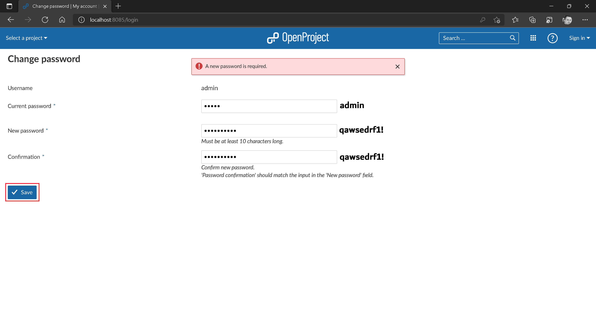

# OpenProject Application Setup

:arrow_backward: [Previous](./00.Module.md) Unit 1 of 14 [Next](./02.CreateRhinoProject.md) :arrow_forward:

Approximately 5 minutes · Unit · [Roei Sabag](https://www.linkedin.com/in/roei-sabag-247aa18/) · Level ★☆☆☆☆

Welcome to Unit 1 of 14! In this unit, we will guide you through the technical setup process for the OpenProject application, an open-source bug tracking and project management tool.

## One-Time Setup: Admin User

To initiate the use of OpenProject, follow these steps:

1. **Access OpenProject**: Visit [http://localhost:8085/](http://localhost:8085/).
2. **Sign In**: Click the `Sign In` button in the top-left corner.
3. **Admin Credentials**: Use the following admin credentials:
   - **Username**: `admin`
   - **Password**: `admin`
4. **Log In**: Click the `Sign In` button again.

   
   _**Unit1_SignIn**_

   At this point, you will be prompted to change the admin password:

5. **Change Password**: Enter the current password `admin` into the `Current password` field.
6. **Set New Password**: Type `qawsedrf1!` into both the `New password` and `Confirmation` fields.
7. **Save Password**: Click the `Save` button to save the new password.

   
   _**Unit1_SetPassword**_

8. **Language Selection**: Choose `English` from the `Language` dropdown.
9. **Save Language Preference**: Click the `Save` button.

   
   _**Unit1_LanguageSelection**_

10. **Skip Intro**: If presented, click on the `Skip` button.

   
   _**Unit1_SkipIntro**_

## One-Time Setup: API Key

To authenticate towards the OpenProject API v3, follow these steps to generate and obtain your API key:

1. **Access Your Account**: Navigate to [http://localhost:8085/](http://localhost:8085/).
2. **Log In**: If required, log in using the credentials you set earlier.
3. **Access Account Settings**: Click on the `User` icon in the top right corner.
4. **Go to My Account**: From the menu, select `My Account`.

   
   _**Unit1_MyAccount**_

5. **Access Access Tokens**: Click on `Access Tokens` in the left navigation panel.
6. **Generate API Token**: Click the `Generate` button under the `API` section.

   
   _**Unit1_GenerateToken**_

7. **Copy API Key**: Copy the API Key from the screen for later use.
  
> :warning: **Important**
>  
> This is the only time you will see this token, so make sure to copy it now. If you lose the API Key, you can generate another one.

## One-Time Setup: Server Host

In this project, OpenProject is part of a composed environment. To ensure correct functionality, follow these steps to change the application's host name:

1. **Access OpenProject**: Open [http://localhost:8085](http://localhost:8085) in any modern browser.
2. **Log In**: If needed, log in using your credentials.
3. **Access Administration**: Click on the `User` icon in the top right corner.
4. **Navigate to System Settings**: From the menu, select `Administration`.

   
   _**Unit1_Administration**_

5. **System Settings**: Click on `System Settings` in the left navigation panel.

   
   _**Unit1_SystemSettings**_

6. **Update Host Name**: In the `Host name` field, enter `openproject`. Select `HTTP` from the `Protocol` dropdown.
7. **Save Changes**: Click the `Save` button at the bottom left corner of the screen.

   
   _**Unit1_UpdateHostName**_

## Next Unit: "Create Rhino Project"

Congratulations! You have successfully completed the technical setup for the OpenProject application.  

[Create Rhino Project](./02.CreateRhinoProject.md) :arrow_forward:
