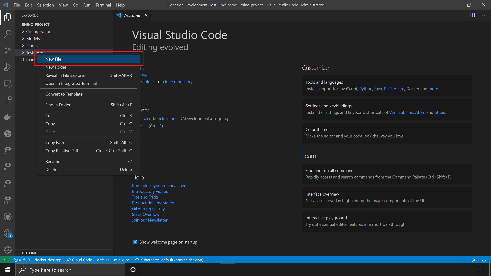
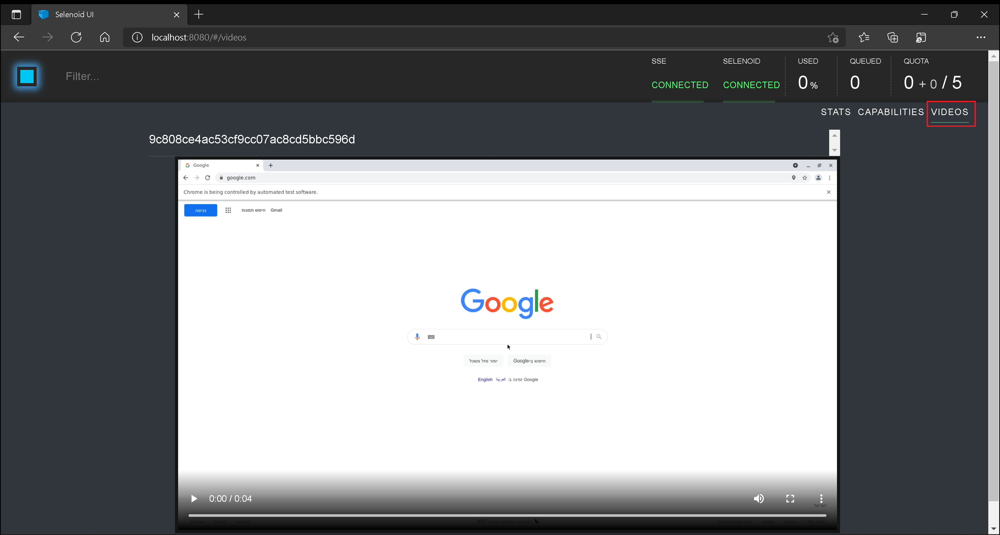

# Unit 2: Creating, Configuring, Integrating, and Validating a Rhino Project

:arrow_backward: [Previous](./01.SetupOpenProjectApplication.md) | [Next](./03.InterceptAndReplicateAPICalls.md) :arrow_forward:

**Approximately 50 min**  
**Level: ★★☆☆☆**  
**Instructor: [Roei Sabag](https://www.linkedin.com/in/roei-sabag-247aa18/)**

## Introduction

In this unit, we'll guide you through creating, configuring, integrating, and validating a Rhino project using Visual Studio Code. Rhino is a powerful automation tool, and we'll explore its key functionalities.

## Create Rhino Project

1. **Create Project Directory**: Start by creating a project directory. For Windows, create `C:\RhinoProject`; for Linux, use `/home/<user>/RhinoProject`.
2. **Launch Visual Studio Code**: Open Visual Studio Code (VS Code).
3. **Access Command Palette**: To access Rhino commands, open the Command Palette by pressing `CTRL`+`SHIFT`+`P`.
4. **Rhino Project Creation**: In the Command Palette, type '**Rhino**' to find the `Rhino: Creates a New Rhino Project` command.

      
    _**Command Palette**_

5. **Select Project Folder**: From the `Select Folder` dialog, navigate to the folder you created in step 1 (`C:\RhinoProject` for Windows or `/home/<user>/RhinoProject` for Linux).
6. **Confirm Selection**: Click the `Select Folder` button.

> :information_source: **Information**
>  
> You can create a new folder directly from the `Select Folder` dialog and select that new folder to host Rhino project files.
>
> The Rhino Project directory structure includes various folders for different Rhino components and a `Manifest.json` file.

## Manifest Setup

Every Rhino project includes a JSON-formatted manifest file, named `Manifest.json`, containing crucial information. Here's how to set it up:

1. **Locate Manifest File**: In Visual Studio Code, find the `Manifest.json` file in the right panel.
2. **Open Manifest File**: Click on the `Manifest.json` file to open it.
3. **Update Manifest Content**: Replace the content of `Manifest.json` with the following code:

```json
{
    "rhinoServer": {
        "schema": "http",
        "host": "localhost",
        "port": "9000"
    },
    "connectorConfiguration": {
        "collection": null,
        "connector": "ConnectorText",
        "password": null,
        "project": null,
        "userName": null
    },
    "authentication": {
        "userName": "<rhino user>",
        "password": "<rhino password>"
    },
    "driverParameters": [
        {
            "driver": "ChromeDriver",
            "driverBinaries": "http://selenoid:4444/wd/hub",
            "capabilities": {
                "selenoid:options": {
                    "enableVNC": true,
                    "enableVideo": true,
                    "name": "this.test.is.launched.by.rhino"
                }
            }
        }
    ],
    "engineConfiguration": {
        "maxParallel": 1,
        "elementSearchingTimeout": 15000,
        "pageLoadTimeout": 60000
    }
}
```

| Field                 | Type   | Description                                                                                      |
|-----------------------|--------|--------------------------------------------------------------------------------------------------|
| rhinoServer           | object | Endpoint of the Rhino server where tests are executed.                                           |
| connectorConfiguration| object | Configuration for integrating Rhino with 3rd-party project management tools like Jira or Azure. |
| authentication        | object | User name and password for Rhino Service authentication.                                         |
| driverParameters      | array  | Driver information, including name, location, and capabilities.                                    |
| engineConfiguration   | object | Configuration for controlling automation engine behavior.                                          |

### Create Your First Test Using Test Snippet

The simplest way to create a Rhino API automation file is to use a built-in snippet. Follow these steps:

1. **Create Test File**: Right-click on the `TestCases` folder.
2. **Add New File**: Select `New File`.

      
    _**New File Context Item**_

3. **Name Test File**: Name your file `MyFirstRhinoAutomation.rhino`.
4. **Access Command Palette**: Open the command palette again by pressing `CTRL`+`SHIFT`+`P`.
5. **Find Rhino Commands**: In the Command Palette, type `Rhino` to find Rhino Commands.
6. **Connect to Rhino**: Select and run the command `Rhino: Connect to Rhino, fetch Metadata & activate commands`.

      
    _**Command Palette**_

    If the Rhino Server is accessible at the address provided in the `Manifest.json` file, you'll receive a confirmation:

      
    _**Connection Confirmation**_

7. **Use Rhino Snippet**: Start typing `rhino` in the test file you created in step 3, and you'll see the `rhinotest` snippet. Select it.

    
    _**Rhino Snippet**_

8. **Edit Snippet**: Once selected, a basic Rhino Spec will be generated. Use the `TAB` key to cycle through the different arguments and parameters in the spec.
9. **Save File**: Save your file.


_**Rhino Snippet**_

### Run Your Test

You can run the test file directly from Visual Studio Code using Rhino. Here's how:

1. **Access Command Palette**: Open the command palette again by pressing `CTRL`+`SHIFT`+`P`.
2. **Find Rhino Commands**: In the Command Palette, type `Rhino` to find Rhino Commands.
3. **Run Rhino Test**: Select and run the command `Rhino: Runs the automation test(s) from the currently open document`.
4. **Monitor Progress**: A progress indication will show in the Visual Studio Code status bar.

    
    _**Command Palette**_

    Once the test invocation is complete, a report will open in a new Visual Studio Code tab.

    
    _**Rhino Report**_

5. **Check Video Output**: Navigate to `http://localhost:8080` in a modern web browser. Click on the `Videos` tab in the top right corner to view your test video output.


_**Selenoid Video Panel**_

## Next Unit: "Intercept And Replicate API Calls"

You've successfully created, configured, integrated, and validated your first Rhino project! Now, proceed to the next unit:  

[Intercept And Replicate API Calls](./03.InterceptAndReplicateAPICalls.md) :arrow_forward:
