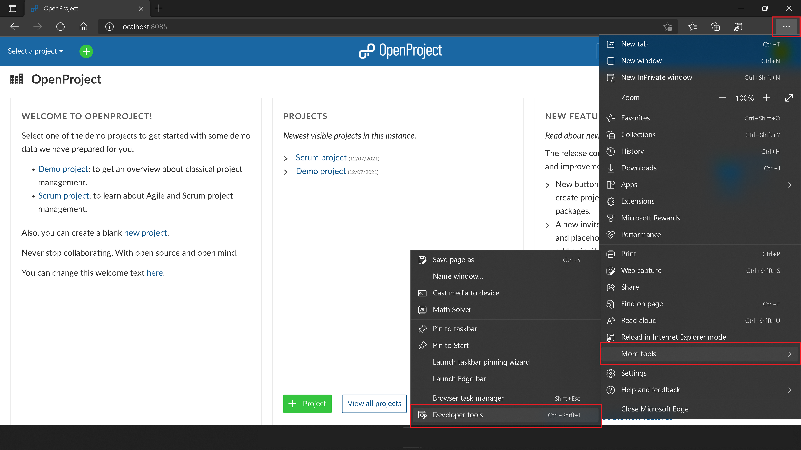
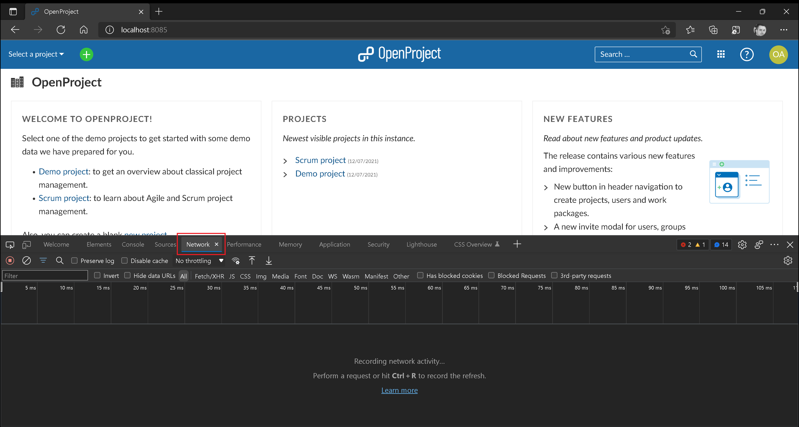
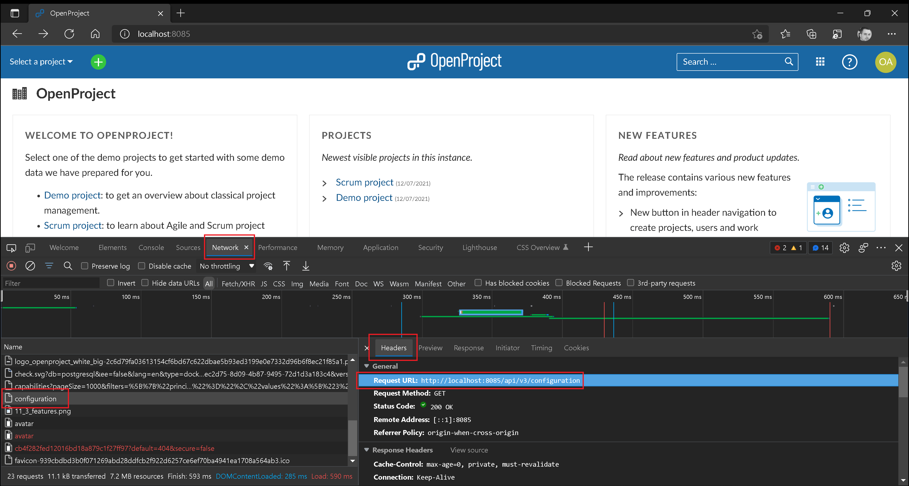
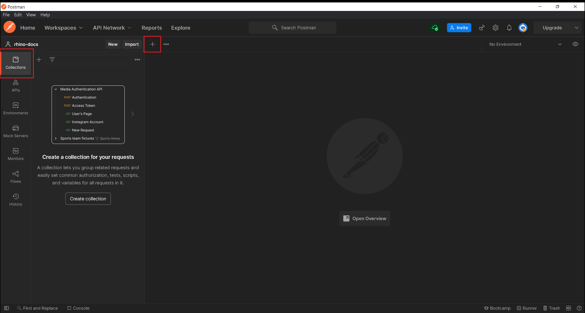
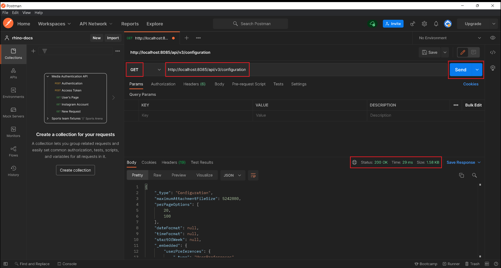

# Intercepting, Replicating, and Invoking API Calls

:arrow_backward: [Previous](./02.CreateRhinoProject.md) Unit 3 of 14 [Next](./04.Test001GetProjectById.md) :arrow_forward:

35 min · Unit · [Roei Sabag](https://www.linkedin.com/in/roei-sabag-247aa18/) · Level ★★★☆☆
  
Developer tools, commonly referred to as "DevTools," are essential for developers to create, test, and debug software. Modern browsers provide integrated developer tools that allow you to inspect a website thoroughly. These tools enable you to inspect and debug HTML, CSS, JavaScript, analyze network traffic, measure performance, and much more.

## Intercept Network Traffic

> :information_source: **Information**
>  
> In the examples below, I'll be using [Edge Chromium](https://www.microsoft.com/en-us/edge?r=1). However, you can use `Chrome`, `Firefox`, `Safari`, or any other modern browser.

1. **Open the Application**: Access [http://localhost:8085](http://localhost:8085) using any modern browser.

2. **Access Developer Tools**: Click on the `More Options` button (represented by three dots) at the top right corner of the screen.

3. **Open More Tools Menu**: Click on the `More tools` menu.

4. **Access Developer Tools**: Click on the `Developer tools` menu-item (you can also use the shortcut `F12` or `CTRL`+`SHIFT`+`I`).

      
    _**image 1.1 - Developer Tools**_

5. **Switch to Network Tab**: In the Developer Tools panel, click on the `Network` tab.

      
    _**image 1.2 - Network Panel**_

6. **Refresh the Page**: While the Developer Tools are open, refresh the page.

7. **Inspect Network Requests**: Under the Network panel, locate and click on the `configuration` request.

8. **View Request Headers**: Click on the `Headers` tab.

9. **Copy the URL**: Copy the URL `http://localhost:8085/api/v3/configuration` for later use.

  
_**image 1.3 - Network Panel**_

## Replicate Network Traffic

1. **Open Postman**: Launch the Postman application. If you don't have it, please ensure you've completed the [Setup Environment](../Tutorials.SetupEnvironment/00.Module.md) Module.

2. **Access Collections**: Click on the `Collections` button on the left-hand actions bar.

3. **Create a New Request**: Click on the `+` sign next to the `Collections` panel to create a new request.

      
    _**image 1.4 - New Request**_

4. **Configure Request**: In the new request:

   - Select `GET` from the request method list.
   - Enter `http://localhost:8085/api/v3/configuration` into the `Address` text-box.
   - Click the `Send` button.

At this point, a request will be sent, and you will receive a response shortly after. The response status code should be `200`, and the response body should contain a `JSON` object with configuration information.

  
_**image 1.5 - Postman Request/Response**_

## Next Unit: "Test 001: API - Get Project by ID"

You've successfully intercepted, replicated, and invoked API calls! Now, proceed to the next unit: [Test 001: API - Get Project by ID](./04.Test001GetProjectById.md) :arrow_forward:
