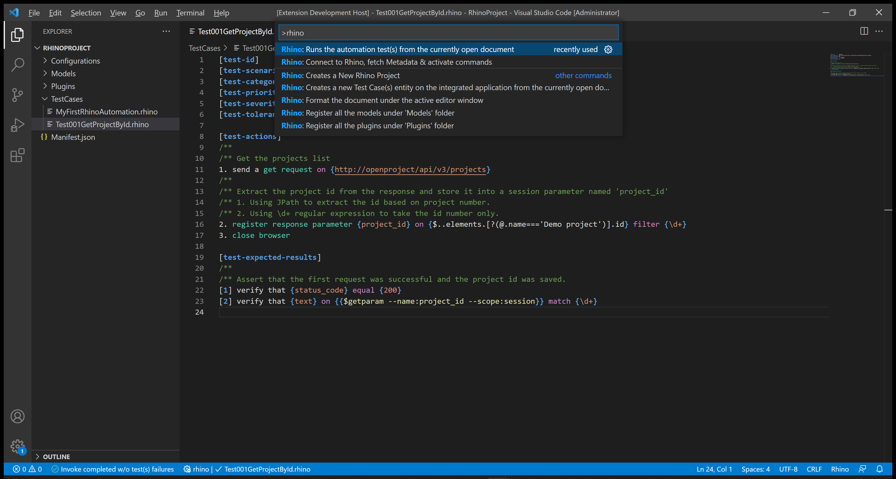
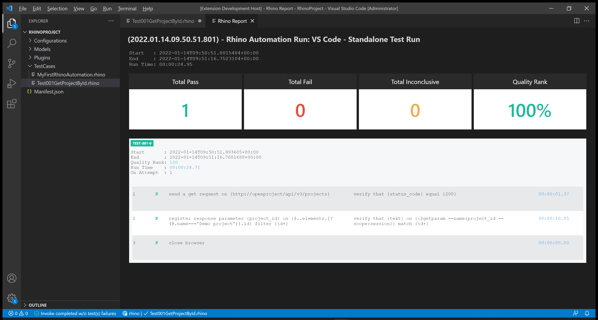

# Test 001: API - Get Project by ID

:arrow_backward: [Previous](./03.InterceptAndReplicateAPICalls.md) Unit 4 of 14 [Next](./05.Test002UpdateProjectById.md) :arrow_forward:

35 min · Unit · [Roei Sabag](https://www.linkedin.com/in/roei-sabag-247aa18/) · Level ★★☆☆☆
  
This test aims to verify the existence of a project named `Demo Project` and its retrieval using the [Open Project API](https://www.openproject.org/docs/api/endpoints/).  

## Prerequisites

- [X] Ensure that a project named `Demo Project` already exists. If not, please refer to the [Setup Environment](../Tutorials.SetupEnvironment/00.Module.md) Module.
- [X] Modify the `driver` value under the `Manifest.json` file from `ChromeDriver` to `MockWebDriver`.
- [X] Change the `driverBinaries` value under `Manifest.json` from `http://selenoid:4444/wd/hub` to `.`

## Test Implementation

> :information_source: **Information**
>  
> The implementation of this test is divided into two phases:
>
> 1. Retrieve the `Demo Project` ID from the list of projects.
> 2. Use the obtained `Demo Project` ID to send a `GetProjectById` request.  

1. **Create a New Test File**:

   - Right-click on the `TestCases` folder.
   - Select `New File`.  
   - Name your file `Test001GetProjectById.rhino`.
   - Click on the `Test001GetProjectById.rhino` file to open it.  

      
    _**image 2.1 - New File Context Item**_  

2. **Write the Test**:

    ```none
    [test-id]         TEST-001
    [test-scenario]   Verify that Demo Project is retrieved when sending a GetProject API request
    [test-categories] API
    [test-priority]   1 - critical
    [test-severity]   1 - critical
    [test-tolerance]  0%

    [test-actions]
    /**
    /** Get the projects list
    1. Send a GET request to {http://openproject/api/v3/projects}
    /**
    /** Extract the project ID from the response and store it in a session parameter named 'project_id'
    /** 1. Use JPath to extract the ID based on project number.
    /** 2. Use \d+ regular expression to capture the ID number only.
    2. Register response parameter {project_id} on {$..elements.[?(@.name==='Demo project')].id} filter {\d+}
    3. Close the browser

    [test-expected-results]
    /**
    /** Assert that the first request was successful and the project ID was saved.
    [1] Verify that {status code} equals {200}
    [2] Verify that {text} on {{$getparam --name:project_id --scope:session}} matches {\d+}
    ```

3. **Run the Test**:

   - Open the command palette by pressing `CTRL`+`SHIFT`+`P`.
   - Type `Rhino` to find Rhino Commands.
   - Select and run the command `Rhino: Runs the automation test(s) from the currently open document`.
   - You'll see a progress indication in the Visual Studio Code status bar.  

    
    _**image 1.2 - Command Palette**_  

Once the test invocation is complete, a report will open in a new Visual Studio Code tab.  


_**image 1.3 - Rhino Report**_

## Breakdown

### Test Metadata

Test Metadata refers to the information and attributes associated with a test case or test script. It provides essential details and context about the test, helping testers and stakeholders understand its purpose, importance, and how it should be executed and interpreted. Test Metadata typically includes various fields and descriptions that help manage and organize the testing process. Here's a breakdown of common elements found in Test Metadata:

| Metadata Field    | Description                                                                                                                                  |
|-------------------|----------------------------------------------------------------------------------------------------------------------------------------------|
| `test-id`         | Unique identifier for the test.                                                                                                              |
| `test-scenario`   | Describes the functionality being tested, in this case, verifying the retrieval of the "Demo Project" when sending a GetProject API request. |
| `test-categories` | Categorizes the test as an API test.                                                                                                         |
| `test-priority`   | Assigns a high priority level (1 - critical) to the test.                                                                                    |
| `test-severity`   | Indicates a high severity level (1 - critical) for any issues found during testing.                                                          |
| `test-tolerance`  | Specifies a tolerance level of 0%, which means that the test expects a precise outcome without any tolerance for variation.                  |

### Test Actions

1. **Get the projects list**:
   - Send a GET request to `http://openproject/api/v3/projects` to retrieve a list of projects.

2. **Extract the project ID from the response and store it in a session parameter named 'project_id'**:
   - Use JPath and regular expressions to extract the project ID based on the project number.
   - Register the extracted project ID as a response parameter named 'project_id' with a filter to ensure it's a number.

3. **Close the browser**:
   - This action closes the current browser session, ensuring no resources are left open after the test.

### Test Expected Results

1. **Assert that the first request was successful and the project ID was saved**:
   - `[1]` Verify that the HTTP status code of the first request equals 200, ensuring a successful request.
   - `[2]` Verify that the text content of the 'project_id' parameter in the session matches the regular expression `\d+`, confirming that it's a numeric value.

In summary, this test (TEST-001) is designed to:

- Send a GET request to retrieve a list of projects.
- Extract the project ID for the "Demo Project" from the response and store it as 'project_id'.
- Verify that the HTTP status code is 200 for the GET request.
- Confirm that the 'project_id' parameter is a numeric value.

The purpose is to ensure that the "Demo Project" can be successfully retrieved via the GetProject API request, and the extracted project ID is valid.

## Next Unit: "Test 002: API - Update Project by ID"

[Continue](./05.Test002UpdateProjectById.md) :arrow_forward:
