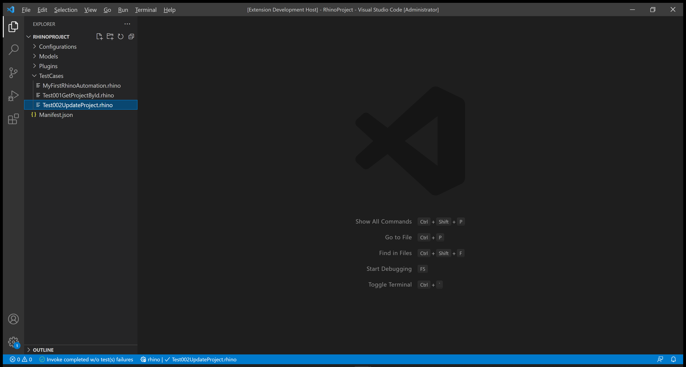
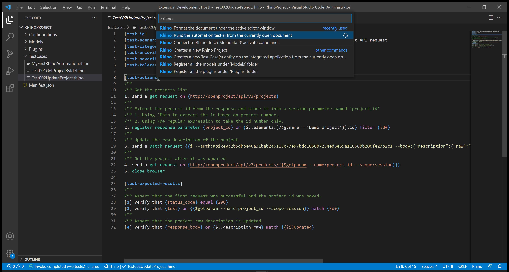
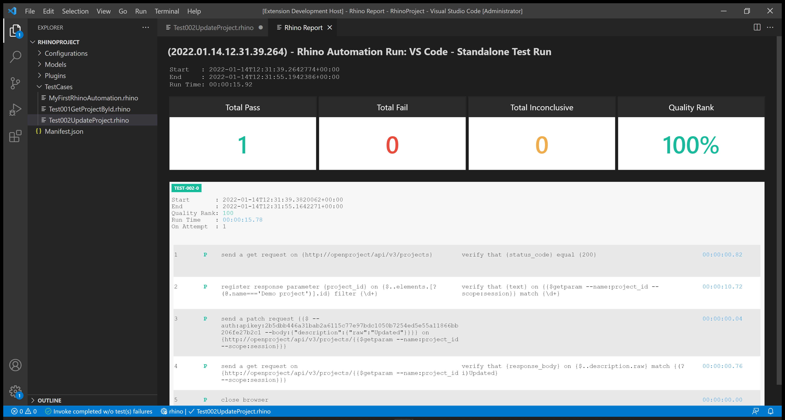
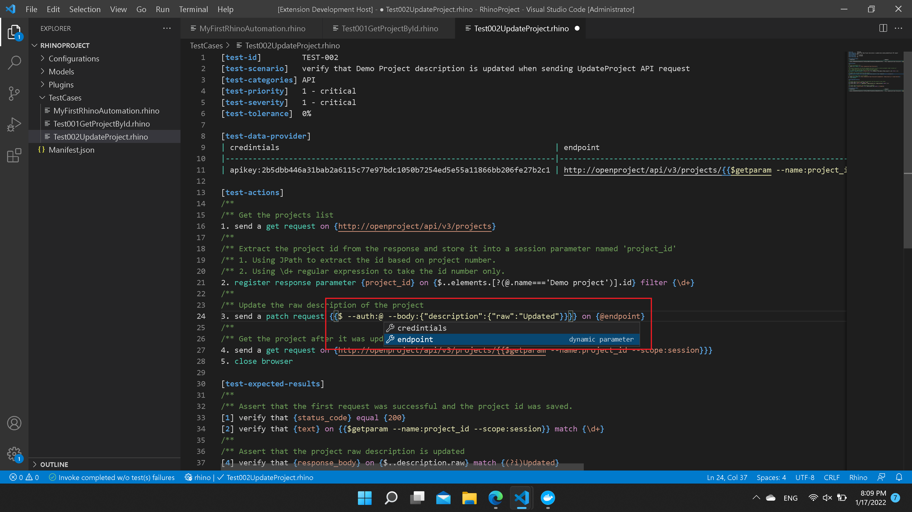

# Unit 5: Test 002: API - Update Project by ID

:arrow_backward: [Previous](./04.Test001GetProjectById.md) | [Next](./06.Test003CreateProject.md) :arrow_forward:  

~35 min · Unit · [Roei Sabag](https://www.linkedin.com/in/roei-sabag-247aa18/) · Level ★★★☆☆

## Introduction

This test aims to verify that a project named `Demo Project` has its description updated according to the data sent by the test using the [Open Project API](https://www.openproject.org/docs/api/endpoints/).

## Prerequisites

Before running the test, make sure to meet the following prerequisites:

- [x] **Existing Project**:
        - A project named `Demo Project` should already exist. If not, follow the [Setup Environment](../../Module.SetupEnvironment/00.Module.md) Module for guidance on creating the project.

- [x] **Driver Configuration**:
        - Modify the `driver` value under the `Manifest.json` file to `MockWebDriver`.

    ```json
    "driver": "MockWebDriver"
    ```

- [x] **Driver Binaries Configuration**:
        - Change the `driverBinaries` value under `Manifest.json` from `http://selenoid:4444/wd/hub` to `.`.

    ```json
    "driverBinaries": "."
    ```

- [x] **API Token**:
        - Ensure you have an API token created. If not, follow the instructions provided [here](./01.SetupOpenProjectApplication.md).

These prerequisites set up the necessary environment for the test to run successfully. Make sure to follow each step to avoid any issues during the test execution.

## Test Implementation

> :information_source: **Information**
>  
> The implementation of this test will be done in 2 phases:
>
> 1. Get `Demo Project` ID from the projects list.
> 2. Use the obtained `Demo Project` ID from the projects list to send an `UpdateProject` request.

1. Right-click on the `TestCases` folder.
2. Select `New File`.
3. Name your file `Test002UpdateProject.rhino`.
4. Click on `Test002UpdateProject.rhino` file to open it.

      

5. Type in the following test.

    ```none
    [test-id]         TEST-002
    [test-scenario]   Verify that Demo Project description is updated when sending UpdateProject API request
    [test-categories] API
    [test-priority]   1 - critical
    [test-severity]   1 - critical
    [test-tolerance]  0%

    [test-actions]
    /**
    /** Get the projects list
    1. Send a GET request to {http://openproject/api/v3/projects}
    /**
    /** Extract the project ID from the response and store it into a session parameter named 'project_id'
    /** 1. Using JPath to extract the ID based on project number.
    /** 2. Using \d+ regular expression to take the ID number only.
    2. Register response parameter {project_id} on {$..elements.[?(@.name==='Demo project')].id} filter {\d+}
    /**
    /** Update the raw description of the project
    3. Send a PATCH request {{$ --auth:apikey:2b5dbb446a31bab2a6115c77e97bdc1050b7254ed5e55a11866bb206fe27b2c1 --body:{"description":{"raw":"Updated"}}}} on {http://openproject/api/v3/projects/{{$getparam --name:project_id --scope:session}}}
    /**
    /** Get the project after it was updated
    4. Send a GET request on {http://openproject/api/v3/projects/{{$getparam --name:project_id --scope:session}}}
    5. Close the browser

    [test-expected-results]
    /**
    /** Assert that the first request was successful and the project ID was saved.
    [1] Verify that {status code} equals {200}
    [2] Verify that {text} on {{$getparam --name:project_id --scope:session}} matches {\d+}
    /**
    /** Assert that the project raw description is updated
    [4] Verify that {response body} on {$..description.raw} matches {(?i)Updated}
    ```

## Run Your Test

Rhino can run the test file directly from `Visual Studio Code` by executing the invoke command.

1. Open the command palette by pressing `CTRL`+`SHIFT`+`P`.
2. Type `Rhino` to find Rhino Commands.
3. Select and run the command `Rhino: Runs the automation test(s) from the currently open document`.
4. A progress indication will show in `Visual Studio Code` status bar.

    

Once the test invocation is complete, a report will be opened under a new `Visual Studio Code` tab.



## Prettify Your Test

Rhino can prettify your test in many ways. One of them is using inline testing parameters which can be passed into the test and help it be more readable.

> :information_source: **Information**
>  
> This step is not mandatory, and you will learn about test prettifying later on.

1. Change your test with the following:

```cmd
[test-id]         TEST-002
[test-scenario]   Verify that Demo Project description is updated when sending UpdateProject API request
[test-categories] API
[test-priority]   1 - critical
[test-severity]   1 - critical
[test-tolerance]  0%

[test-data-provider]
|credentials                                                            |endpoint                                                                          |
|-----------------------------------------------------------------------|----------------------------------------------------------------------------------|
|apikey:2b5dbb446a31bab2a6115c77e97bdc1050b7254ed5e55a11866bb206fe27b2c1|http://openproject/api/v3/projects/{{$getparam --name:project_id --scope:session}}|

[test-actions]
/**
/** Get the projects list
1. Send a GET request to {http://openproject/api/v3/projects}
/**
/** Extract the project ID from the response and store it into a session parameter named 'project_id'
/** 1. Using JPath to extract the ID based on project number.
/** 2. Using \d+ regular expression to take the ID number only.
2. Register response parameter {project_id} on {$..elements.[?(@.name==='Demo project')].id} filter {\d+}
/**
/** Update the raw description of the project
3. Send a PATCH request {{$ --auth:@credentials --body:{"description":{"raw":"Updated"}}}} on {@endpoint}
/**
/** Get the project after it was updated
4. Send a GET request on {@endpoint}
5. Close the browser

[test-expected-results]
/**
/** Assert that the first request was successful and the project ID was saved.
[1] Verify that {status code} equals {200}
[2] Verify that {text} on {{$getparam --name:project_id --scope:session}} matches {\d+}
/**
/** Assert that the project raw description is updated
[4] Verify that {response body} on {$..description.raw} matches {(?i)Updated}
```

Please notice the `@endpoint` parameter reuse and how the test is more readable. Rhino allows you to add any parameter with any name (including spaces) to make your automation as readable as possible.

Once you have set a parameter under the parameters table, it will automatically appear in the auto-complete intellisense when you type `@` sign.

    
    _**image 1.4 - Auto Complete**_

## Breakdown

### Test Metadata

The test metadata holds important information about your test. There are many metadata fields, and it can also use custom fields which are directly derived from your `Application Lifecycle Manager` (e.g., Jira, Azure DevOps, Test Rail, XRay, etc.).

| Field           | Meaning                                                                                                                                  |
|-----------------|------------------------------------------------------------------------------------------------------------------------------------------|
| test-id         | The unique identifier of the test. Please note that Rhino **will distinguish** tests by their ID.                                      |
| test-scenario   | A statement describing the functionality to be tested.                                                                                   |
| test-categories | A comma-separated list of categories (also referred to as 'Tags' or 'Marks') to which this test belongs.                                 |
| test-priority   | The level of **business importance** assigned to an item, e.g., a defect.                                                                 |
| test-severity   | The degree of **impact** that a defect has on the development or operation of a component or system.                                     |
| test-tolerance  | The % of the test tolerance. A special attribute to decide, based on configuration, if the test will be marked as passed or with a warning. |

### Test Actions

The numbers beside each action do not have any effect on the test itself and were designed to increase the test readability and to make it easier to assign expected results for each action based on the action positional location.

**Actions (Plugins) Call:**

1. `GET request` - sends an HTTP `GET` request to the `OpenProject` server at the address `http://openproject/api/v3/projects` to get all the available projects.
2. `Register response parameter` - gets the project `id` value by using [JPath (JSON Path)](https://goessner.net/articles/JsonPath/) on the response body from the previous request.
3. `PATCH request` - sends an HTTP `PATCH` request to the `OpenProject` server at the address `http://openproject/api/v3/projects/<project_id>` to update the project description.
4. `GET request` - sends an HTTP `GET` request to the `OpenProject` server at the address `http://openproject/api/v3/projects/<project_id>` to get the project that has been updated by the previous `GET` request.
5. `Close browser` - closes the current driver session; without it, the driver session will remain available until the next `Rhino API` restart.

### Test Expected Results

The numbers beside each expected result point to the action it asserts based on the action positional under `[test-actions]` section. It is possible to point multiple assertions to the same action.

**Actions (Plugins) Call:**

1. `Status code` - asserts that the HTTP status code returned by the last `GET` request action is `200`.
2. `Text` - asserts that the `project_id` parameter value is a number (e.g., matches `\d+`).
3. `GET param` - when used within a CLI block (e.g., blocks that start with `{{$` and end with `}}`), it will retrieve a parameter by the parameter name and the parameter scope. In our case, the parameter we saved with the project `id` value. In conjunction with `Text` assertion, we can evaluate the `project_id` parameter value.
4. `Response body` - asserts that the description of the project found by the given [JPath (JSON Path)](https://goessner.net/articles/JsonPath/) in the response body of the previous request was updated.

## Next Unit: "Test 003: API - Create Project"

[Continue](./06.Test003CreateProject.md) :arrow_forward:
