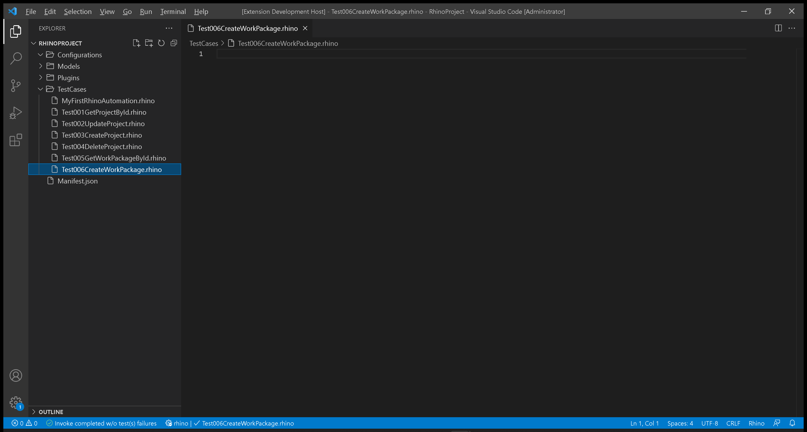
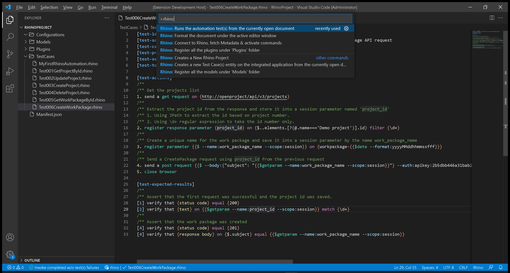
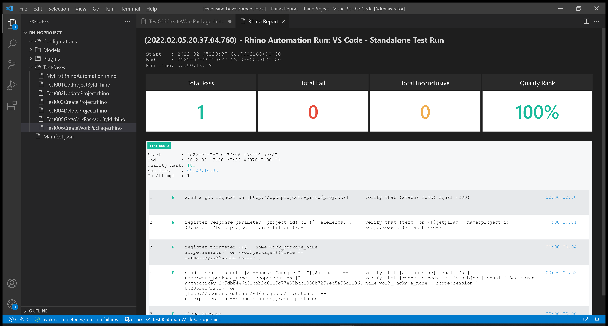

# Test 006: API - Create Work Package

:arrow_backward: [Previous](./08.Test005GetWorkPackageById.md) Unit 9 of 14 [Next](./10.Test007UpdateWorkPackage.md) :arrow_forward:

35 min · Unit · [Roei Sabag](https://www.linkedin.com/in/roei-sabag-247aa18/) · Level ★★☆☆☆
  
The test will verify that a new `Task` work package with a random unique name was created according to the data sent by the test.  

## Prerequisites

- [X] A project named `Demo Project` already exists. Follow [Setup Environment](../Tutorials.SetupEnvironment/00.Module.md) if it does not.
- [X] Change the `driver` value under `Manifest.json` file from `ChromeDriver` to `MockWebDriver`.
- [X] Change the `driverBinaries` value under `Manifest.json` from `http://selenoid:4444/wd/hub` to `.`.
- [X] You have created an api token, if you have not, [please follow these instructions](./01.SetupOpenProjectApplication.md).

## Test Implementation

> :information_source: **Information**
>  
> The implementation of this test will be done in 3 phases.
>
> 1. Get `Demo Project` id from the projects list.
> 2. Save the new project id into a parameter called `project_id`.
> 3. Use the `project_id` parameter to send `Create Work Package` request with a unique name.  

1. Right click on `TestCases` folder.
2. Select `New File`.  
3. Name your file `Test006CreateWorkPackage.rhino`.
4. Click on `Test006CreateWorkPackage.rhino` file to open it.  

  
_**image 1.1 - New File Context Item**_  

1. Type in the following test.  

```cmd
[test-id]         TEST-006
[test-scenario]   verify that a new work package is created when sending CreateWorkPackage API request
[test-categories] API
[test-priority]   1 - critical
[test-severity]   1 - critical
[test-tolerance]  0%

[test-actions]
/**
/** Get the projects list
1. send a get request on {http://openproject/api/v3/projects}
/**
/** Extract the project id from the response and store it into a session parameter named 'project_id'
/** 1. Using JPath to extract the id based on project number.
/** 2. Using \d+ regular expression to take the id number only.
2. register response parameter {project_id} on {$..elements.[?(@.name==='Demo project')].id} filter {\d+}
/**
/** Create a unique name for the work package and save it into a session parameter by the name work_package_name
3. register parameter {{$ --name:work_package_name --scope:session}} on {workpackage-{{$date --format:yyyyMMddhhmmssfff}}}
/**
/** Send a CreatePackage request using project_id from the previous request
4. send a post request {{$ --body:{"subject": "{{$getparam --name:work_package_name --scope:session}}"} --auth:apikey:2b5dbb446a31bab2a6115c77e97bdc1050b7254ed5e55a11866bb206fe27b2c1}} on {http://openproject/api/v3/projects/{{$getparam --name:project_id --scope:session}}/work_packages}
5. close browser

[test-expected-results]
/**
/** Assert that the first request was successful and the project id was saved.
[1] verify that {status code} equal {200}
[2] verify that {text} on {{$getparam --name:project_id --scope:session}} match {\d+}
/**
/** Assert that the work package was created
[4] verify that {status code} equal {201}
[4] verify that {response body} on {$.subject} equal {{$getparam --name:work_package_name --scope:session}}
```  

## Run your Test

Rhino can run the test file directly from `Visual Studio Code`, by executing the invoke command.  

1. Open command palette by pressing `CTRL`+`SHIFT`+`P`.
2. Type `Rhino` to find Rhino Commands.
3. Select and run the command `Rhino: Runs the automation test(s) from the currently open document`.
4. A progress indication will show in `Visual Studio Code` status bar.  


_**image 1.2 - Command Palette**_  

When test invocation is complete, a report will be opened under a new `Visual Studio Code` tab.  


_**image 1.3 - Rhino Report**_  

## Breakdown

### Test Metadata

The test metadata holds an important information about your test. There are many metadata fields and it can also use custom fields which are directly derived from your `Application Lifecycle Manager` (e.g., Jira, Azure DevOps, Test Rail, XRay, etc.).

| Field           | Meaning                                                                                                                                  |
|-----------------|------------------------------------------------------------------------------------------------------------------------------------------|
| test-id         | The unique identifier of the test. Please note the Rhino **will distinct** tests by their ID.                                            |
| test-scenario   | A statement describing the functionality to be tested.                                                                                   |
| test-categories | A comma separated list of categories (also refers as 'Tags' or 'Marks') to which this test belongs to.                                   |
| test-priority   | The level of **business importance** assigned to an item, e.g., defect.                                                                  |
| test-severity   | The degree of **impact** that a defect has on the development or operation of a component or system.                                     |
| test-tolerance  | The % of the test tolerance. A Special attribute to decide, based on configuration if the test will be marked as passed or with warning. |

### Test Actions

The numbers beside each action does not have any affect on the test itself and were designed to increase the test readability and to make it easier to assign expected results for each action based on the action positional location.  

**Actions (Plugins) Call:**  

1. `get request` - sends an HTTP `GET` request to `OpenProject` server on address `http://openproject/api/v3/projects` to get a list of all projects.
2. `register response parameter` - gets the project `id` value by using [JPath (JSON Path)](https://goessner.net/articles/JsonPath/) on the response body from the previous request.
3. `register parameter` - creates a `work_package_name` parameter which is composed of a static string `workpackage-` and a unique, date-time based number (e.g., workpackage-20220127190947989).
4. `date` - a macro for getting the current date and time. The `format` switch allows to provide a [date-time format](https://docs.microsoft.com/en-us/dotnet/standard/base-types/standard-date-and-time-format-strings).
5. `post request` - sends an HTTP `POST` request to `OpenProject` server on address `http://openproject/api/v3/projects/<project_id>/work_packages` to create a new work package.
6. `close browser` - closes the current driver session, without it the driver session will remain available until the next `Rhino API` restart.  

### Test Expected Results

The numbers beside each expected result points to the action it asserts based on the action positional under `[test-actions]` section. It is possible to point multiple assertions to the same action.  

**Actions (Plugins) Call:**  

1. `status code` - asserts that the HTTP StatusCode that was returned by the last `GET` request action is `200`.
2. `response body` - asserts that the `project_id` found by the given [JPath (JSON Path)](https://goessner.net/articles/JsonPath/) in the response body of the previous request is a number (e.g., mathc `\d+`).
3. `status code` - asserts that the HTTP StatusCode that was returned by the `POST` request action is `201`.
4. `response body` - asserts that the name of the work package found by the given [JPath (JSON Path)](https://goessner.net/articles/JsonPath/) in the response body of the previous request equals to the work package expected name.

## Next Unit: "Test 007: API - Update Work Package"

[Continue](./10.Test007UpdateWorkPackage.md) :arrow_forward:
