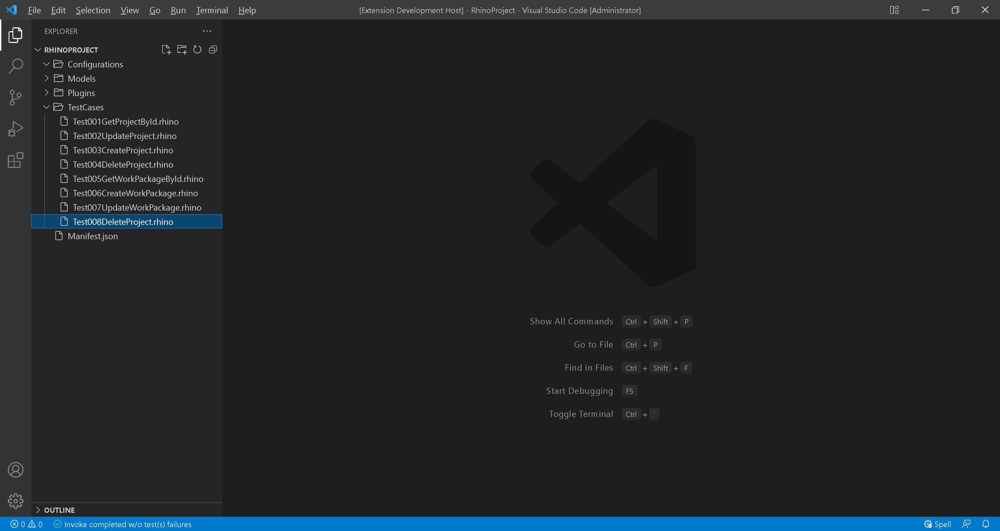
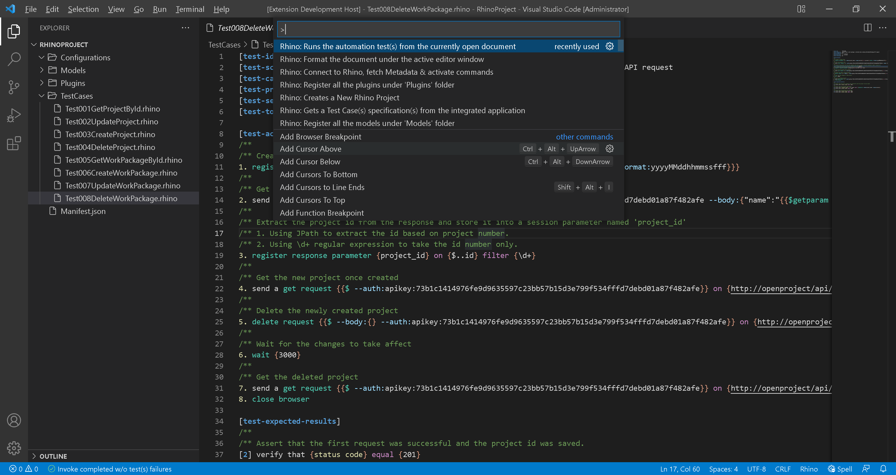
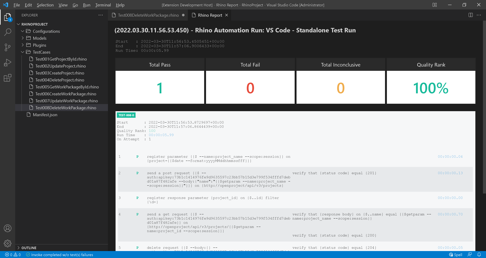

# Test 008: API - Delete Work Package

:arrow_backward: [Previous](./10.Test007UpdateWorkPackage.md) Unit 11 of 14 [Next](./12.Test009CreateProject.md) :arrow_forward:

35 min · Unit · [Roei Sabag](https://www.linkedin.com/in/roei-sabag-247aa18/) · Level ★★★★☆
  
The test will verify that an existing `Work Package` can be deleted.  

## Prerequisites

- [X] A project named `Demo Project` already exists. Follow [Setup Environment](../Tutorials.SetupEnvironment/00.Module.md) if it does not.
- [X] Change the `driver` value under `Manifest.json` file from `ChromeDriver` to `MockWebDriver`.
- [X] Change the `driverBinaries` value under `Manifest.json` from `http://selenoid:4444/wd/hub` to `.`.
- [X] You have created an api token, if you have not, [please follow these instructions](./01.SetupOpenProjectApplication.md).

## Test Implementation

> :information_source: **Information**
> Deletes the work package, as well as:  
>
> - all associated time entries
> - its hierarchy of child work packages
>  
> The implementation of this test will be done in 4 phases.
>
> 1. Create a new project.
> 2. Verify that the new project was created.
> 3. Delete the new project.
> 4. Verify that the new project was deleted.  

1. Right click on `TestCases` folder.
2. Select `New File`.  
3. Name your file `Test008DeleteWorkPackage.rhino`.
4. Click on `Test008DeleteWorkPackage.rhino` file to open it.  

  
_**image 1.1 - New File Context Item**_  

1. Type in the following test.  

```cmd
[test-id]         TEST-008
[test-scenario]   verify that a work package can be deleted when sending DeleteWorkPackage API request
[test-categories] API
[test-priority]   1 - critical
[test-severity]   1 - critical
[test-tolerance]  0%

[test-actions]
/**
/** Create WorkPackage
1.  send a get request on {http://openproject/api/v3/projects}
2.  register response parameter {project_id} on {$..elements.[?(@.name==='Demo project')].id} filter {\d+}
3.  register parameter {{$ --name:work_package_name --scope:session}} on {workpackage-{{$date --format:yyyyMMddhhmmssfff}}}
4.  send a post request {{$ --body:{"subject": "{{$getparam --name:work_package_name --scope:session}}"} --auth:apikey:56fc06c2892eea8ea1179970eae3b90134c9d52aabd084eef9c250fbf0b88085}} on {http://openproject/api/v3/projects/{{$getparam --name:project_id --scope:session}}/work_packages}
5.  register response parameter {package_id} on {$.id} filter {\d+}
/**
/** Delete WorkPackage
6.  send a get request {{$ --auth:apikey:56fc06c2892eea8ea1179970eae3b90134c9d52aabd084eef9c250fbf0b88085}} on {http://openproject/api/v3/work_packages/{{$getparam --name:package_id --scope:session}}}
7.  send a delete request {{$ --body:{} --auth:apikey:56fc06c2892eea8ea1179970eae3b90134c9d52aabd084eef9c250fbf0b88085}} on {http://openproject/api/v3/work_packages/{{$getparam --name:package_id --scope:session}}}
8.  wait {3000}
9.  send a get request {{$ --auth:apikey:56fc06c2892eea8ea1179970eae3b90134c9d52aabd084eef9c250fbf0b88085}} on {http://openproject/api/v3/work_packages/{{$getparam --name:package_id --scope:session}}}
10. close browser

[test-expected-results]
/**
/** Verify WorkPackage creation
[1]  verify that {status code} equal {200}
[2]  verify that {text} on {{$getparam --name:project_id --scope:session}} match {\d+}
[4]  verify that {status code} equal {201}
[4]  verify that {response body} on {$.subject} equal {{$getparam --name:work_package_name --scope:session}}
[6]  verify that {status code} equal {200}
[6]  verify that {response body} on {$.id} equal {{$getparam --name:package_id --scope:session}}
/**
/** Verify WorkPackage deletion
[7]  verify that {status code} equal {204}
[9]  verify that {status code} equal {404}
```  

## Run your Test

Rhino can run the test file directly from `Visual Studio Code`, by executing the invoke command.  

1. Open command palette by pressing `CTRL`+`SHIFT`+`P`.
2. Type `Rhino` to find Rhino Commands.
3. Select and run the command `Rhino: Runs the automation test(s) from the currently open document`.
4. A progress indication will show in `Visual Studio Code` status bar.  


_**image 1.2 - Command Palette**_  

When test invocation is complete, a report will be opened under a new `Visual Studio Code` tab.  


_**image 1.3 - Rhino Report**_  

## Breakdown

### Test Metadata

The test metadata holds an important information about your test. There are many metadata fields and it can also use custom fields which are directly derived from your `Application Lifecycle Manager` (e.g., Jira, Azure DevOps, Test Rail, XRay, etc.).

| Field           | Meaning                                                                                                                                  |
|-----------------|------------------------------------------------------------------------------------------------------------------------------------------|
| test-id         | The unique identifier of the test. Please note the Rhino **will distinct** tests by their ID.                                            |
| test-scenario   | A statement describing the functionality to be tested.                                                                                   |
| test-categories | A comma separated list of categories (also refers as 'Tags' or 'Marks') to which this test belongs to.                                   |
| test-priority   | The level of **business importance** assigned to an item, e.g., defect.                                                                  |
| test-severity   | The degree of **impact** that a defect has on the development or operation of a component or system.                                     |
| test-tolerance  | The % of the test tolerance. A Special attribute to decide, based on configuration if the test will be marked as passed or with warning. |

### Test Actions

The numbers beside each action does not have any affect on the test itself and were designed to increase the test readability and to make it easier to assign expected results for each action based on the action positional location.  

**Actions (Plugins) Call:**  

1. `get request` - sends an HTTP `GET` request to `OpenProject` server on address `http://openproject/api/v3/projects` to get a list of all projects.
2. `register response parameter` - gets the project `id` value by using [JPath (JSON Path)](https://goessner.net/articles/JsonPath/) on the response body from the previous request.
3. `register parameter` - creates a `work_package_name` parameter which is composed of a static string `workpackage-` and a unique, date-time based number (e.g., workpackage-20220127190947989).
4. `date` - a macro for getting the current date and time. The `format` switch allows to provide a [date-time format](https://docs.microsoft.com/en-us/dotnet/standard/base-types/standard-date-and-time-format-strings).
5. `post request` - sends an HTTP `POST` request to `OpenProject` server on address `http://openproject/api/v3/projects/<project_id>/work_packages` to create a new work package.
6. `register response parameter` - gets the work package `id` value by using [JPath (JSON Path)](https://goessner.net/articles/JsonPath/) on the response body from the previous request.
7. `get request` - sends an HTTP `GET` request to `OpenProject` server on address `http://openproject/api/v3/work_packages/<package_id>` to get a work package entity by using the `package_id` parameter from the previous request.
8. `delete request` - sends an HTTP `DELETE` request to `OpenProject` server on address `http://openproject/api/v3/work_packages/<package_id>` to delete a work package entity by using the `package_id` parameter from the previous request.
9. `wait` - a static wating time to make sure the changes took affect. Without it the test might fail.
10. `get request` - sends an HTTP `GET` request to `OpenProject` server on address `http://openproject/api/v3/work_packages/<package_id>` to get a work package entity by using the `package_id` parameter from the previous request.
11. `close browser` - closes the current driver session, without it the driver session will remain available until the next `Rhino API` restart.

### Test Expected Results

The numbers beside each expected result points to the action it asserts based on the action positional under `[test-actions]` section. It is possible to point multiple assertions to the same action.  

**Actions (Plugins) Call:**  

1. `status code` - asserts that the HTTP StatusCode that was returned by the last `GET` request action is `200`.
2. `text` - asserts that the value saved under `package_id` parameter is a number (e.g, match `\d+`).
3. `status code` - asserts that the HTTP StatusCode that was returned by the last `POST` request action is `201`.
4. `response body` - asserts that the package `subject` found by the given [JPath (JSON Path)](https://goessner.net/articles/JsonPath/) in the response body of the previous request match to the value we want to update it to.
5. `status code` - asserts that the HTTP StatusCode that was returned by the last `GET` request action is `200`.
6. `response body` - asserts that the package `id` found by the given [JPath (JSON Path)](https://goessner.net/articles/JsonPath/) in the response body of the previous request match to `package_id` parameter.
7. `status code` - asserts that the HTTP StatusCode that was returned by the last `DELETE` request action is `204`.
8. `status code` - asserts that the HTTP StatusCode that was returned by the last `GET` request action is `404`, meaning the work package was deleted.

### Next Unit: "Test 009: UI - Create Project"

[Continue](./12.Test009CreateProject.md) :arrow_forward:
