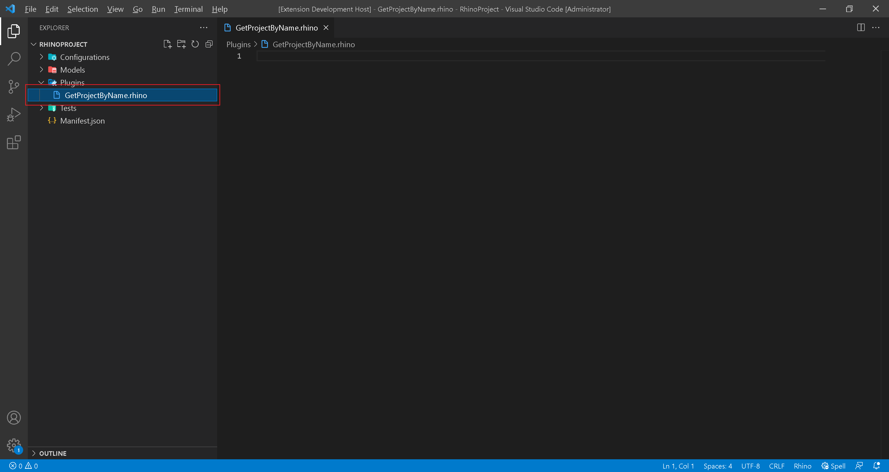
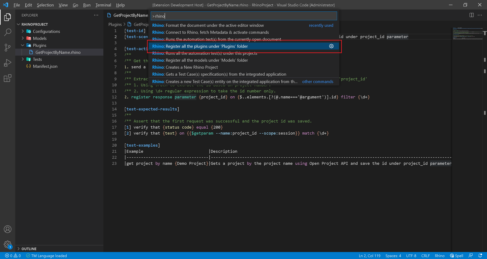
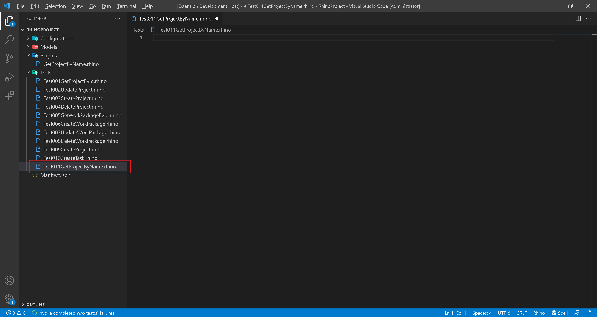
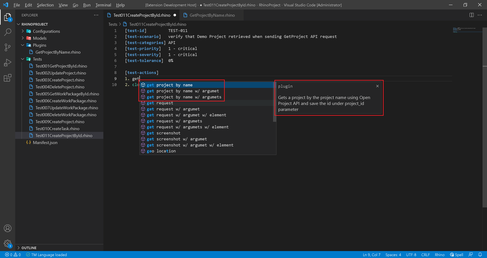
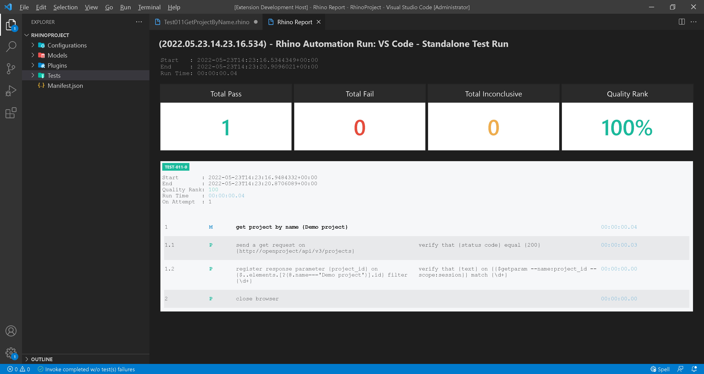

# Create Plugin: Get Project by Name

:arrow_backward: [Previous](./00.Module.md) Unit 1 of 14 [Next](./02.CreatePluginUpdateProjectByName.md) :arrow_forward:

15 min · Unit · [Roei Sabag](https://www.linkedin.com/in/roei-sabag-247aa18/) · Level ★★★☆☆

## Create Get Project Plugin

Creates a plugin to get a project by the project name and save the project id under `project_id` parameter.  

1. Right click on `Plugins` folder.
2. Click on `New File` option under the `Context Menu`.
3. Name the file `GetProjectByName.rhino`.
4. Click on the file `GetProjectByName.rhino` to open it.  

  
_**image 1.1 - Get Project by Name**_  

1. Type in the following plugin.  

```cmd
[test-id]         GetProjectByName
[test-scenario]   Gets a project by the project name using Open Project API and save the id under project_id parameter

[test-actions]
/**
/** Get the projects list
1. send a get request on {http://openproject/api/v3/projects}
/**
/** Extract the project id from the response and store it into a session parameter named 'project_id'
/** 1. Using JPath to extract the id based on project number.
/** 2. Using \d+ regular expression to take the id number only.
2. register response parameter {project_id} on {$..elements.[?(@.name==='@argument')].id} filter {\d+}

[test-expected-results]
/**
/** Assert that the first request was successful and the project id was saved.
[1] verify that {status code} equal {200}
[2] verify that {text} on {{$getparam --name:project_id --scope:session}} match {\d+}

[test-examples]
| Example                            | Description                                                                                                  |
|------------------------------------|--------------------------------------------------------------------------------------------------------------|
| get project by name {Demo Project} | Gets a project by the name `Demo Project` using Open Project API and save the id under project_id parameter. |
```  

## Register Plugins

Rhino can run the register plugins directly from `Visual Studio Code`, by executing the register command.  

1. Open command palette by pressing `CTRL`+`SHIFT`+`P`.
2. Type `Rhino` to find Rhino Commands.
3. Select and run the command `Rhino: Register all the plugins under 'Plugins' folder`.
4. A progress indication will show in `Visual Studio Code` status bar.  


_**image 1.2 - Command Palette**_  

When registration invocation is complete, an indication says `TM Language loaded` is shown in the status bar.

## Breakdown

Plugin is identical in structure to a regular test case, with few exceptions that must be attend.

### Gravity Parameters

When you create your plugin you can consume parameters from the plugin user, based on Gravity API contract. The parameters available are:  

| Parameter          | Description                                                                                  |
|--------------------|----------------------------------------------------------------------------------------------|
| @argument          | Will take the value from the `argument` field.                                               |
| @onElement         | Will take the value from the `onElement` field (comes after `on|into|to|of|take`).           |
| @onAttribute       | Will take the value from the `onAttribute` field (comes after `from`).                       |
| @locator           | Will take the value from the `locatorType` field (comes after `by|using`).                   |
| @regularExpression | Will take the value from the `regularExpression` field (comes after `regex|pattern|filter`). |

### Examples

Rhino API enforces you to provide at-least one valid example of how to use the plugin you have created. This is designed to allow the plugin users to easily understand how to consume your plugin and put it to a good use.  

| Field       | Description                                                        |
|-------------|--------------------------------------------------------------------|
| Example     | A valid example of how to consume the plugin using Rhino Language. |
| Description | A description for the provided example.                            |

## Use the Plugin

1. Right click on `TestCases` or `Tests` folder.
2. Select `New File`.  
3. Name your file `Test011GetProjectByName.rhino`.
4. Click on `Test011GetProjectByName.rhino` file to open it.  

  
_**image 1.3 - New File Context Item**_  

1. Type in the following test.

```cmd
[test-id]         TEST-011
[test-scenario]   verify that Demo Project retrieved when sending GetProject API request
[test-categories] API
[test-priority]   1 - critical
[test-severity]   1 - critical
[test-tolerance]  0%

[test-actions]
1. get project by name {Demo project}
2. close browser
```  

Please notice that once registered, you can see your plugin under the intellisense.  

  
_**image 1.4 - New File Context Item**_

## Run your Test

Rhino can run the test file directly from `Visual Studio Code`, by executing the invoke command.  

1. Open command palette by pressing `CTRL`+`SHIFT`+`P`.
2. Type `Rhino` to find Rhino Commands.
3. Select and run the command `Rhino: Runs the automation test(s) from the currently open document`.
4. A progress indication will show in `Visual Studio Code` status bar.  

When test invocation is complete, a report will be opened under a new `Visual Studio Code` tab. Please notice that the report shows the plugin breakdown.  


_**image 1.5 - Rhino Report**_  

## Next Unit: "Create Plugin - Update Project by Name"

[Continue](./02.CreatePluginUpdateProjectByName.md) :arrow_forward:
