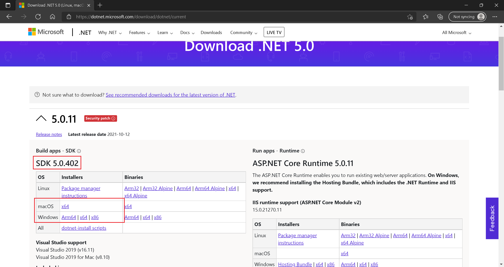

:arrow_backward: [Previous](./00.Module.md) Unit 1 of 6 [Next](./02.DeploymentProcessHost.md) :arrow_forward:

# Install and Configure .NET Certificate
10 min · Unit · [Roei Sabag](https://www.linkedin.com/in/roei-sabag-247aa18/) · Level ★★☆☆☆  

> :information_source: **Information**
> 
> These steps are relevant only for `MAC OS` and `Windows`. For `Linux` please read this [GitHub Thread](https://github.com/dotnet/aspnetcore/issues/32842).

## Install Latest .NET
### Windows, Mac OS
1. Go to [.NET download page](https://dotnet.microsoft.com/download/dotnet/current).
2. Download the .NET SDK installer suites for OS.

  
_**image 1.1 - .NET SDK Download Page**_  

3. Run the installer file, once download is complete.
4. Follow the installer instructions.

### Linux
* [Ubuntu](https://docs.microsoft.com/en-us/dotnet/core/install/linux-ubuntu).
* [Alpine](https://docs.microsoft.com/en-us/dotnet/core/install/linux-alpine).
* [CentOS](https://docs.microsoft.com/en-us/dotnet/core/install/linux-centos).
* [Debian](https://docs.microsoft.com/en-us/dotnet/core/install/linux-debian).
* [Fedora](https://docs.microsoft.com/en-us/dotnet/core/install/linux-fedora).
* [OpenSUSE](https://docs.microsoft.com/en-us/dotnet/core/install/linux-opensuse).
* [RHEL](https://docs.microsoft.com/en-us/dotnet/core/install/linux-rhel).
* [SLES](https://docs.microsoft.com/en-us/dotnet/core/install/linux-sles).
* [Install with Snap](https://docs.microsoft.com/en-us/dotnet/core/install/linux-snap).
* [Install Manually](https://docs.microsoft.com/en-us/dotnet/core/install/linux-scripted-manual).

## Trust SSL Certificate
1. Open `Command Line` as administrator.
2. Run the following commands (**approve any dialog if appears**):  

```bash
$ dotnet --info
$ dotnet dev-certs https --trust
```

---
### Next Unit: Rhino API Deployment - Process Host
### [Continue](./02.DeploymentProcessHost.md) :arrow_forward:
---
