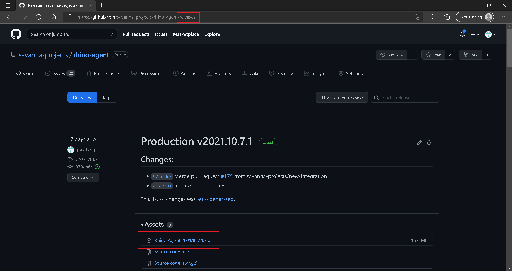

:arrow_backward: [Previous](./01.ConfigureDotnetAndSSLCertificate.md) Unit 2 of 6 [Next](./03.DeploymentDocker.md) :arrow_forward:

# Rhino API Deployment - Process Host
5 min · Unit · [Roei Sabag](https://www.linkedin.com/in/roei-sabag-247aa18/) · Level ★☆☆☆☆  

## Run as Process
1. Download the latest [Rhino Agent](https://github.com/savanna-projects/rhino-agent/releases) ZIP file.  

  
_**image 1.1 - Rhino API Releases**_  

2. Extract the file and place the extracted folder under `C:\Rhino\Agent`.
3. Navigate into the folder `C:\Rhino\Agent`.
4. Run the following command:  

``` bash
$ dotnet Rhino.Agent.dll
```  

The following output is expected:  

```bash
Now listening on: https://localhost:9001
Now listening on: http://localhost:9000
Application started. Press Ctrl+C to shut down.
```  

---
### Next Unit: Rhino API Deployment - Docker Container
### [Continue](./03.DeploymentDocker.md) :arrow_forward:
---
