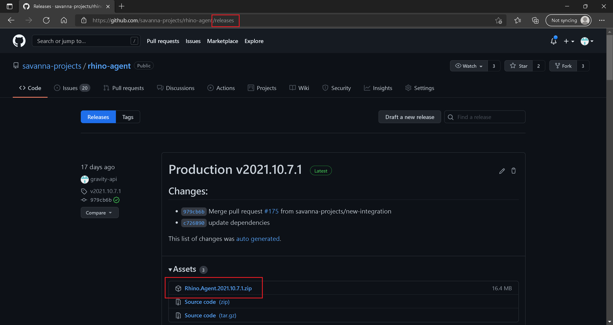
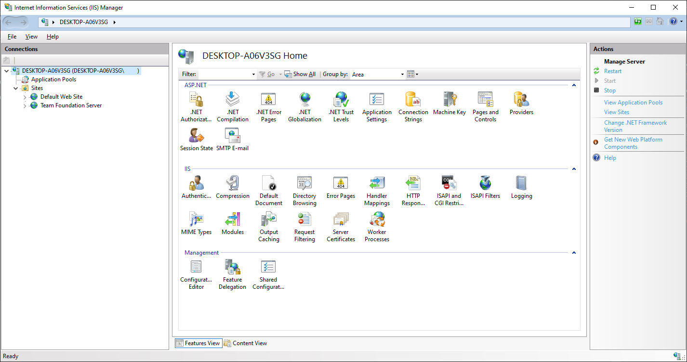
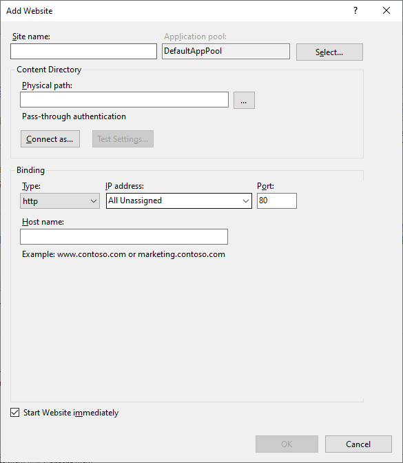
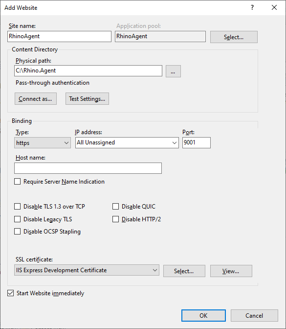
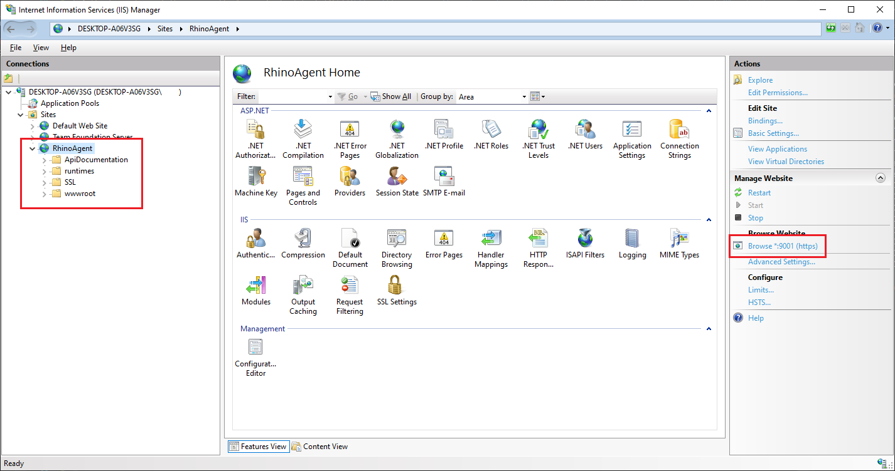

:arrow_backward: [Previous](./03.DeploymentDocker.md) Unit 4 of 6 [Next](./05.ServerSettings.md) :arrow_forward:

# Rhino API Deployment - Internet Information Services (IIS)
20 min · Unit · [Roei Sabag](https://www.linkedin.com/in/roei-sabag-247aa18/) · Level ★★★☆☆  

> :warning: **Warning**
> 
> IIS configuration and website security involve concepts that aren't covered by this tutorial. Consult the IIS guidance in the [Microsoft IIS documentation](https://www.iis.net/) and the [ASP.NET Core article on hosting with IIS](https://docs.microsoft.com/en-us/aspnet/core/host-and-deploy/iis/?view=aspnetcore-5.0) before hosting production apps on IIS.
>
> Important scenarios for IIS hosting not covered by this tutorial include:
>
> * [Creation of a registry hive for ASP.NET Core Data Protection](https://docs.microsoft.com/en-us/aspnet/core/host-and-deploy/iis/?view=aspnetcore-5.0#data-protection).
> * [Configuration of the app pool's Access Control List (ACL)](https://docs.microsoft.com/en-us/aspnet/core/host-and-deploy/iis/?view=aspnetcore-5.0#application-pool-identity).

## Supported OS
The following operating systems are supported:  

* Windows 7 or later
* Windows Server 2012 R2 or later  

Apps published for 32-bit (x86) or 64-bit (x64) deployment are supported. Deploy a 32-bit app with a 32-bit (x86) .NET Core SDK unless the app:  

* Requires the larger virtual memory address space available to a 64-bit app.
* Requires the larger IIS stack size.
* Has 64-bit native dependencies.

## Prerequisites
* [.NET Core SDK installed on the development machine](./01.ConfigureDotnetAndSSLCertificate.md).
* Windows Server configured with the Web Server (IIS) server role. If your server isn't configured to host websites with IIS, follow the guidance in the IIS configuration section of the [Host ASP.NET Core on Windows with IIS](https://docs.microsoft.com/en-us/aspnet/core/host-and-deploy/iis/?view=aspnetcore-5.0#iis-configuration) article and then return to this tutorial.

## Install the .NET Core Hosting Bundle on Windows Server
Install the _**.NET Core Hosting Bundle**_ on the IIS server. The bundle installs the .NET Core Runtime, .NET Core Library, and the [ASP.NET Core Module](https://docs.microsoft.com/en-us/aspnet/core/host-and-deploy/aspnet-core-module?view=aspnetcore-5.0). The module allows ASP.NET Core apps to run behind IIS.  

Download the installer using the following link:  
[Current .NET Core Hosting Bundle installer (direct download)](https://dotnet.microsoft.com/permalink/dotnetcore-current-windows-runtime-bundle-installer)  

1. Run the installer on the IIS server.
2. Restart the server or execute `net stop was /y` followed by `net start w3svc` in a command shell.

## Create an IIS site in IIS Manager
1. Download the latest [Rhino Agent](https://github.com/savanna-projects/rhino-agent/releases) ZIP file.  

  
_**image 1.1 - Rhino API Releases**_  

2. Extract the file and place the extracted folder under `C:\Rhino\Agent` (make sure the files are extract and you don't have a folder inside a folder).
3. Open a command line as an administrator.
4. Type in the command `%windir%\system32\inetsrv\InetMgr.exe`.  

  
_**image 1.1 - IIS Control Panel**_   

5. Right click on `Sites` folder.
6. Click on `Add Website...` option under `Sites` context-menu.  

  
_**image 1.2 - Add Web Site Dialog**_ 

7. Type `RhinoAgent` under `Site name` text-box.
8. Type `C:\Rhino\Agent` under `Physical path` text-box.
9. Select `https` from `Type` combo-box under `Binding` panel.
10. Type `9001` into `Port` text-box under `Binding` panel.
11. Select a certificate from `SSL certificate` combo-box under `Binding` panel.
12. Check `Start Website immediately` check-box.
13. Click on `OK` button.  

  
_**image 1.3 - Add Web Site Dialog**_ 

14. Select `RhinoAgent` site and expand it to see the files deployed in it.
15. Click on `Browse` link in the right panel.  

  
_**image 1.4 - Add Web Site Dialog**_  

## See Also
* [Publish an ASP.NET Core app to IIS](https://docs.microsoft.com/en-us/aspnet/core/tutorials/publish-to-iis?view=aspnetcore-5.0&tabs=visual-studio).
* [Host ASP.NET Core on Windows with IIS](https://docs.microsoft.com/en-us/aspnet/core/host-and-deploy/iis/?view=aspnetcore-5.0).  

---
### Next Unit: Rhino API Deployment - Server Settings
### [Continue](./05.ServerSettings.md) :arrow_forward:
---
