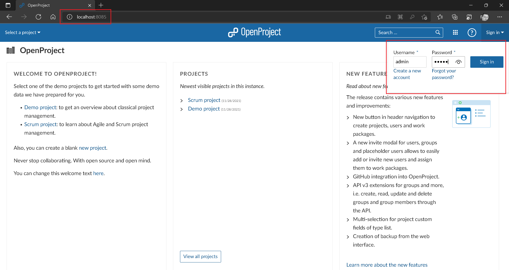
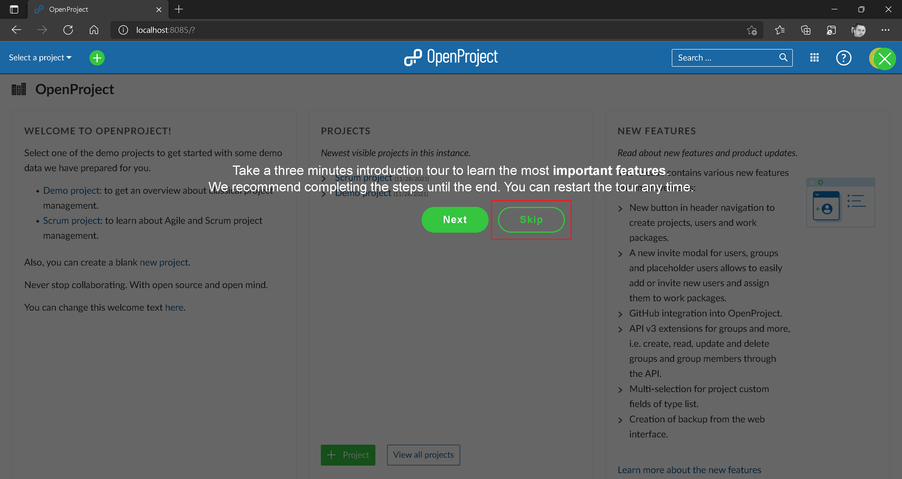

# Setup OpenProject Application

:arrow_backward: [Previous](./00.Module.md) Unit 1 of 10 [Next](./02.CreateRhinoProject.md) :arrow_forward:

5 min · Unit · [Roei Sabag](https://www.linkedin.com/in/roei-sabag-247aa18/) · Level ★☆☆☆☆

OpenProject is an open source bug tracking and project management application.

## One Time Setup: Admin User

1. Navigate to [http://localhost:8085/](http://localhost:8085/).
2. Click on `Sign in` button in the top left corner of the screen.
3. Type `admin` into `Username` text-box.
4. Type `admin` int `Password` text-box.
5. Click on `Sign in` button.  

  
_**image 1.1 - Login Panel**_  

_**At this point the `Change Password` page opens**_  

1. Type `admin` into `Current password` text-box.
2. Type `qawsedrf1!` into `New password` text-box.
3. Type `qawsedrf1!` into `Confirmation` text-box.
4. Click on `Save` button.  

  
_**image 1.2 - Change Password Page**_  

1. Select `English` from the `Language` combo-box.
2. Click on `Save` button.

  
_**image 1.3 - Select Language Panel**_  

1. Click on `Skip` button.  

  
_**image 1.4 - Skip Button**_

## One Time Setup: API Key

Users can authenticate towards the API v3 using basic authentication with apikey (as a string, NOT your API key) as the user name and their API key as the password. Users can find their API key on their account page.  

1. Open [http://localhost:8085](http://localhost:8085) using any modern browser.
2. If needed, perform a login, based on the user and password you have set in the previous section.
3. Click on the `User` icon on the top right corner.
4. From the menu, click on `My Account` menu-item.  

  
_**image 1.5 - My Account**_  

1. Click on `Access Tokens` on the left navigation panel.
2. Click on `Generate` button under the `API` row.  

  
_**image 1.6 - Generate API Token**_  

1. Copy the API Key from the screen and save it for later use.  

> :warning: **Important**
>  
> This is the only time you will see this token, make sure to copy it now. If you lost the API Key, you can generate another one.  

### Next Unit: Create Rhino Project

### [Continue](./02.CreateRhinoProject.md) :arrow_forward:
