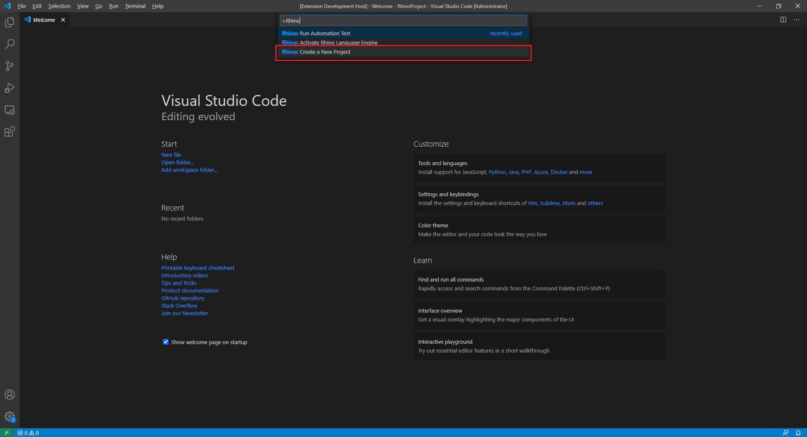
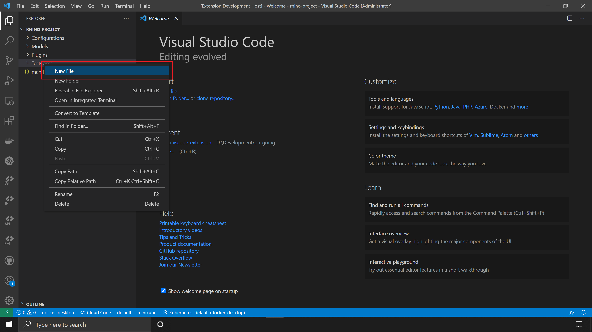
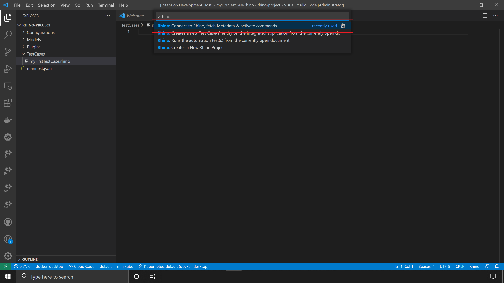
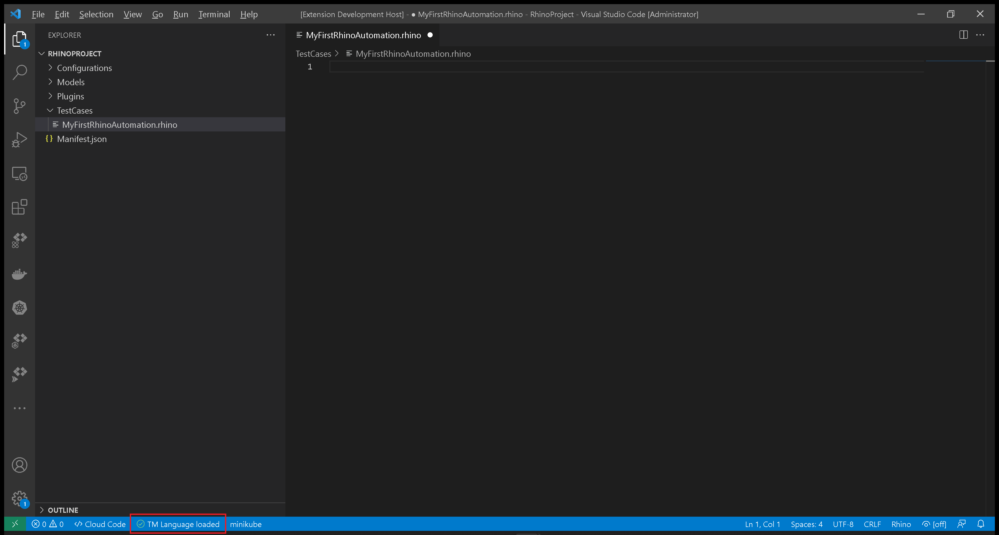
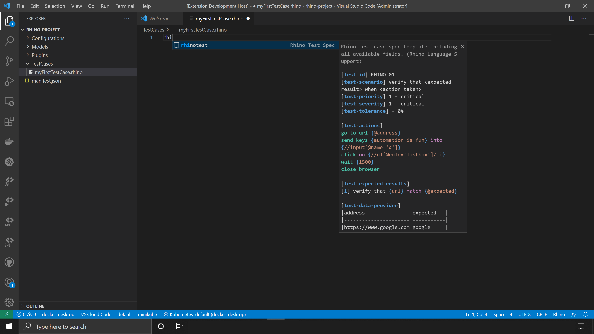
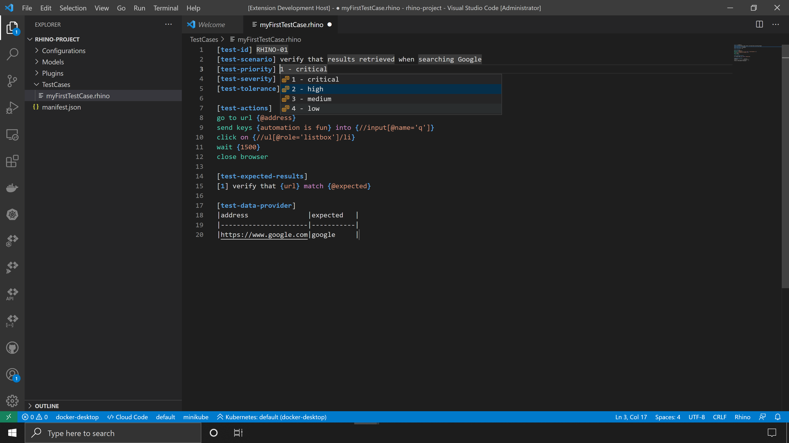
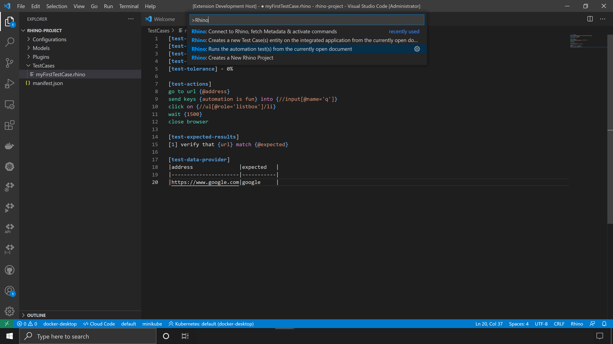
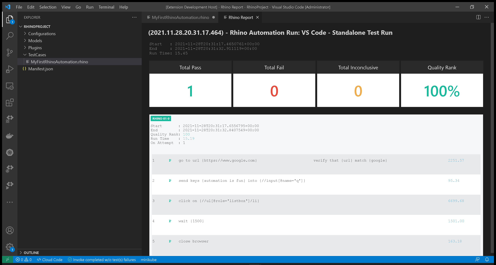
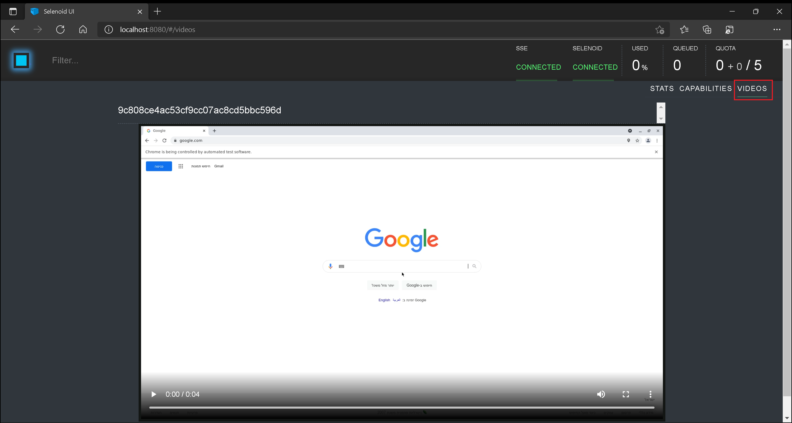

# Create, Configure, Integrate & Validate Rhino Project

:arrow_backward: [Previous](./01.SetupOpenProjectApplication.md) Unit 2 of 10 [Next](./03.InterceptAndReplicateAPICalls.md) :arrow_forward:

5 min · Unit · [Roei Sabag](https://www.linkedin.com/in/roei-sabag-247aa18/) · Level ★☆☆☆☆

When you first open Visual Studio Code, the start window appears, and from there, you can run the `Rhino: Create a new project` command. The `Command Palette` is the primary way to interact with `Rhino API` and invoke automation commands.

## Create Rhino Project

1. Create a folder `C:\RhinoProject` on `Windows` or `/home/<user>/RhinoProject` on `Linux`
2. Launch VS Code.
3. Open the `Command Palette` using `CTRL`+`SHIFT`+`P`.
4. Type '**Rhino**' to find the `Rhino: Creates a New Rhino Project` command.
  
  
_**image 1.1 - Command Palette**_  

1. From the `Select Folder` dialog, navigate to folder `C:\RhinoProject` on `Windows` or `/home/<user>/RhinoProject` on `Linux`.
2. Click on `Select Folder` button.  

> :information_source: **Information**
>  
> You can create a new folder directly from the `Select Folder` dialog and select that new folder to host Rhino project files.
>
> Rhino Project contains several folders for the different Rhino components and a `Manifest.json` file.

## Manifest Setup

Every project has a JSON-formatted manifest file, named `Manifest.json`, that provides important information.  

> :information_source: **Information**
>  
> The `userName` and `password` under `authentication` section, are the user name and password you have used to [create your Rhino API account](../Unit.CreateRhinoAccount.md).

1. In `Visual Studio Code` under the right panel, find the file `Manifest.json`.
2. Click on `Manifest.json` file.
3. Replace the `Manifest.json` file content with the following code.

```js
{
    "rhinoServer": {
        "schema": "http",
        "host": "localhost",
        "port": "9000"
    },
    "connectorConfiguration": {
        "collection": null,
        "connector": "ConnectorText",
        "password": null,
        "project": null,
        "userName": null
    },
    "authentication": {
        "userName": "<rhino user>",
        "password": "<rhino password>"
    },
    "driverParameters": [
        {
            "driver": "ChromeDriver",
            "driverBinaries": "http://selenoid:4444/wd/hub",
            "capabilities": {
                "selenoid:options": {
                    "enableVNC": true,
                    "enableVideo": true,
                    "name": "this.test.is.launched.by.rhino"
                }
            }
        }
    ],
    "engineConfiguration": {
        "maxParallel": 1,
        "elementSearchingTimeout": 15000,
        "pageLoadTimeout": 60000
    }
}
```

|Field                 |Type  |Description                                                                                               |
|----------------------|------|----------------------------------------------------------------------------------------------------------|
|rhinoServer           |object|The endpoint of Rhino server. This is the server where tests are sent when executing.                     |
|connectorConfiguration|object|Provides the configuration for integrating Rhino with 3rd party project managements such as Jira or Azure.|
|authentication        |object|User name and password for authentication on Rhino Service.                                               |
|driverParameters      |array |A collection of driver names their location, and capabilities.                                            |
|engineConfiguration   |object|Configure and controls the automation engine behavior.                                                    |

### Create Your First Test Using Test Snippet

The easiest way to create a `Rhino API` automation file, is to use the built in snippet. Please follow these steps to create your first automation file:  

1. Right click on `TestCases` folder.
2. Select `New File`.  

  
_**image 2.1 - New File Context Item**_  

1. Name your file `MyFirstRhinoAutomation.rhino`.
2. Open command palette by pressing `CTRL`+`SHIFT`+`P`.
3. Type `Rhino` to find Rhino Commands.
4. Select and run the command `Rhino: Connect to Rhino, fetch Metadata & activate commands`.  

  
_**image 2.2 - Command Palette**_  

If Rhino Server is up, running and accessible in the address provided under the project `Manifest.json`, the following confirmation will be displayed.  

  
_**image 2.3 - Connection Confirmation**_  

1. Start type `rhino` in the test file you have created on step no.3, the `rhinotest` snippet is now visible and can be selected.  


_**image 2.4 - Rhino Snippet**_  

1. Once selected, a basic Rhino Spec will be generated and displayed.
2. Use the `TAB` key to cycle the different arguments and parameters in the spec.
3. Save your file.  


_**image 2.5 - Rhino Snippet**_  

### Run Your Test

Rhino can run the test file directly from `Visual Studio Code`, by executing the invoke command.  

> :information_source: **Information**
>  
> Selenoid allows you to see your test in runtime and also takes a video of your test.

1. Open command palette by pressing `CTRL`+`SHIFT`+`P`.
2. Type `Rhino` to find Rhino Commands.
3. Select and run the command `Rhino: Runs the automation test(s) from the currently open document`.
4. A progress indication will show in `Visual Studio Code` status bar.  


_**image 3.1 - Command Palette**_  

When test invocation is complete, a report will be opened under a new `Visual Studio Code` tab.  


_**image 3.2 - Rhino Report**_  

1. Navigate to `http://localhost:8080` using any modern web browser.
2. Click on `Videos` tab in the top right corner of your screen.
3. Check you video output.  


_**image 3.2 - Selenoid Video Panel**_

### Next Unit: Intercept And Replicate API Calls

### :arrow_forward: [Continue](./03.InterceptAndReplicateAPICalls.md)
