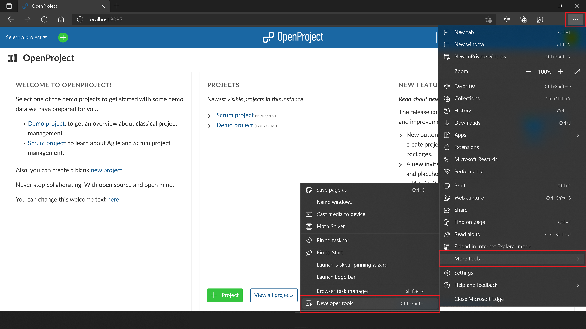
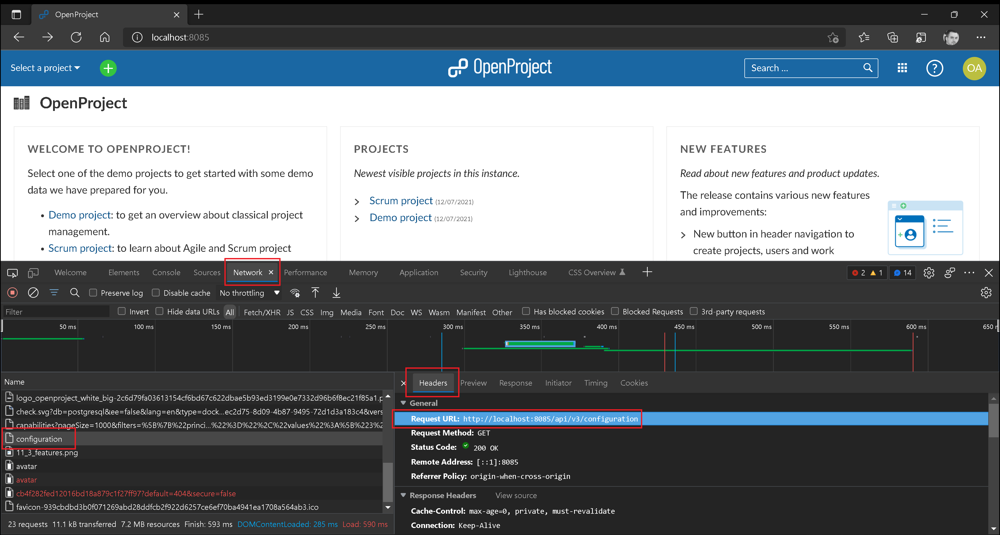
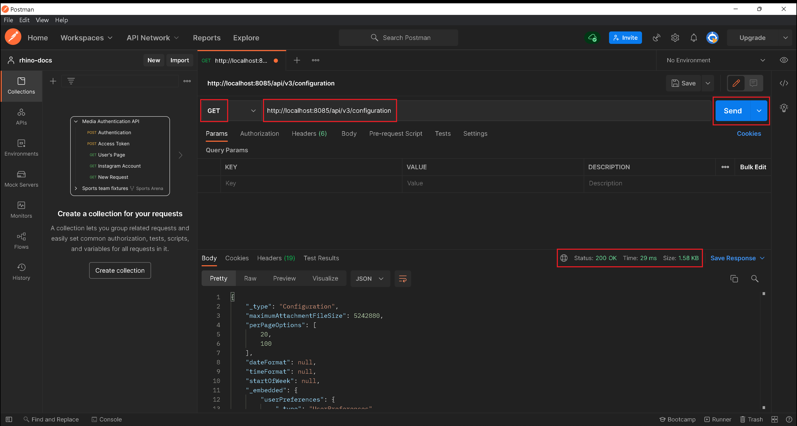

# Intercept, Replicate & Invoke API Calls

:arrow_backward: [Previous](./02.CreateRhinoProject.md) Unit 3 of 10 [Next](./04.Test001GetProjectById.md) :arrow_forward:

35 min · Unit · [Roei Sabag](https://www.linkedin.com/in/roei-sabag-247aa18/) · Level ★★★☆☆
  
Developer tools (or "development tools" or short "DevTools") are programs that allow a developer to create, test and debug software. Current browsers provide integrated developer tools, which allow to inspect a website.  

They let users inspect and debug the page's HTML, CSS, and JavaScript, allow to inspect the network traffic it causes, make it possible to measure it's performance, and much more.

## Intercept Network Traffic
  
> :information_source: **Information**
>  
> On the examples below I will be using `Edge Chromium`, but it is possible to use `Chrome`, `Firefox`, `Safari` or any other modern browser.

1. Open [http://localhost:8085](http://localhost:8085) using any modern browser.
2. Click on `More Options` button (3 dots at the top right corner of the screen).
3. Click on `More tools` Menu.
4. Click on `Developer tools` menu-item (a shortcut can be `F12` or `CTRL`+`SHIFT`+`P`).  

  
_**image 1.1 - Developer Tools**_  

1. Click on `Network` tab under `Developer Tools` panel.  

  
_**image 1.2 - Network Panel**_  

1. Refresh the page, while the `Developer Tools` are open.
2. Under the `Network` panel, find and click on `configuration` request.
3. Click on `Headers` tab.
4. Copy the URL `http://localhost:8085/api/v3/configuration` for later use.

  
_**image 1.3 - Network Panel**_  

## Replicate Network Traffic

1. Open `Postman` application. If you do not have it, please make sure you have completed the [Setup Environment](../Tutorials.SetupEnvironment/00.Module.md) Module.
2. Click on `Collections` button under the left actions bar.
3. Click on the `+` sign right next to the `Collections` panel to create a new request.  

  
_**image 1.4 - New Request**_  

1. Select `GET` from the request method list.
2. Type `http://localhost:8085/api/v3/configuration` into `Address` text-box.
3. Click on `Send` button.

At this point a request will be sent and a response will follow shortly after. The response status code is `200` and the response body is `JSON` object with configuration information.  

  
_**image 1.5 - Postman Request/Response**_  
