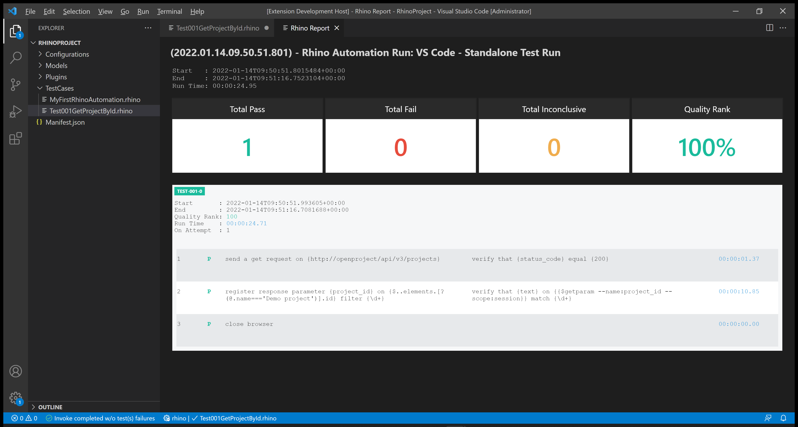

# Test 001: API - Get Project by ID

:arrow_backward: [Previous](./03.InterceptAndReplicateAPICalls.md) Unit 4 of 10 [Next](./05.Test002UpdateProjectById.md) :arrow_forward:

35 min · Unit · [Roei Sabag](https://www.linkedin.com/in/roei-sabag-247aa18/) · Level ★★☆☆☆
  
The test will verify that a project by name `Demo Project` exists and can be retrieved using `Open Project API`.  

## Prerequisites

1. A project named `Demo Project` already exists. Follow [Setup Environment](../Tutorials.SetupEnvironment/00.Module.md) if it does not.
2. Change the `driver` value under `Manifest.json` file from `ChromeDriver` to `MockWebDriver`.
3. Change the `driverBinaries` value under `Manifest.json` from `http://selenoid:4444/wd/hub` to `.`

## Test Implementation

> :information_source: **Information**
>  
> The implementation of this test will be done in 2 phases.
>
> 1. Get `Demo Project` id from the projects list.
> 2. Use `Demo Project` id from the projects list to send `GetProjectById` request.  

1. Right click on `TestCases` folder.
2. Select `New File`.  
3. Name your file `Test001GetProjectById.rhino`.
4. Click on `Test001GetProjectById.rhino` file to open it.  

  
_**image 2.1 - New File Context Item**_  

1. Type in the following test.

```rhino
[test-id]         TEST-001
[test-scenario]   verify that Demo Project retrieved when sending GetProject API request
[test-categories] API
[test-priority]   1 - critical
[test-severity]   1 - critical
[test-tolerance]  0%

[test-actions]
/**
/** Get the projects list
1. send a get request on {http://openproject/api/v3/projects}
/**
/** Extract the project id from the response and store it into a session parameter named 'project_id'
/** 1. Using JPath to extract the id based on project number.
/** 2. Using \d+ regular expression to take the id number only.
2. register response parameter {project_id} on {$..elements.[?(@.name==='Demo project')].id} filter {\d+}
3. close browser

[test-expected-results]
/**
/** Assert that the first request was successful and the project id was saved.
[1] verify that {status_code} equal {200}
[2] verify that {text} on {{$getparam --name:project_id --scope:session}} match {\d+}
```

## Run your Test

Rhino can run the test file directly from `Visual Studio Code`, by executing the invoke command.  

> :information_source: **Information**
>  
> Selenoid allows you to see your test in runtime and also takes a video of your test.

1. Open command palette by pressing `CTRL`+`SHIFT`+`P`.
2. Type `Rhino` to find Rhino Commands.
3. Select and run the command `Rhino: Runs the automation test(s) from the currently open document`.
4. A progress indication will show in `Visual Studio Code` status bar.  


_**image 1.1 - Command Palette**_  

When test invocation is complete, a report will be opened under a new `Visual Studio Code` tab.  


_**image 1.2 - Rhino Report**_

### Next Unit: Test 002 - Update Project by ID

### :arrow_forward: [Continue](./05.Test002UpdateProjectById.md)
