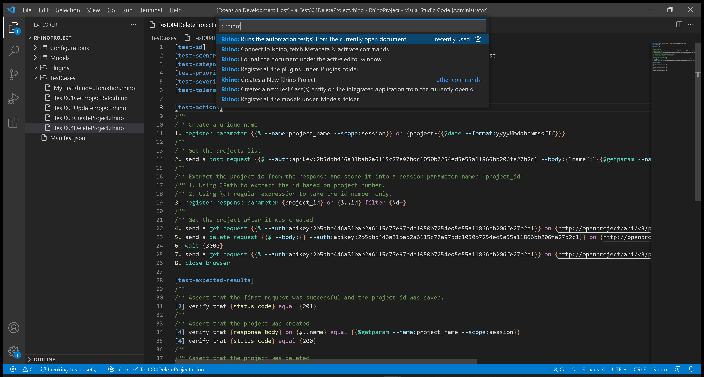
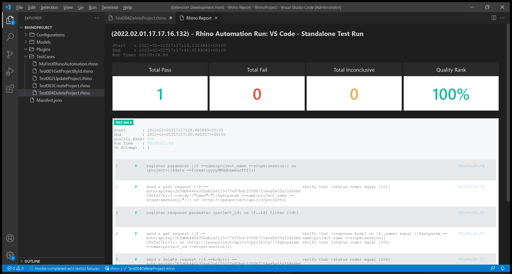

# Test 004: API - Delete Project

:arrow_backward: [Previous](./06.Test003CreateProject.md) Unit 6 of 10 [Next](./08.Test005GetWorkPackageById.md) :arrow_forward:

35 min · Unit · [Roei Sabag](https://www.linkedin.com/in/roei-sabag-247aa18/) · Level ★★★★☆
  
The test will verify that a new project with a random unique name was created and deleted according to data sent by the test.  

## Prerequisites

- [X] Change the `driver` value under `Manifest.json` file from `ChromeDriver` to `MockWebDriver`.
- [X] Change the `driverBinaries` value under `Manifest.json` from `http://selenoid:4444/wd/hub` to `.`.
- [X] You have created an api token, if you have not, [please follow these instructions](./01.SetupOpenProjectApplication.md).

## Test Implementation

> :information_source: **Information**
>  
> The implementation of this test will be done in 3 phases.
>
> 1. Create a new project with a unique name.
> 2. Save the new project id into a parameter called `project_id`.
> 3. Use the `project_id` parameter to send `DeleteProject` request.  

1. Right click on `TestCases` folder.
2. Select `New File`.  
3. Name your file `Test004DeleteProject.rhino`.
4. Click on `Test004DeleteProject.rhino` file to open it.  

  
_**image 1.1 - New File Context Item**_  

1. Type in the following test.  

```cmd
[test-id]         TEST-004
[test-scenario]   verify that a new project is deleted when sending DeleteProject API request
[test-categories] API
[test-priority]   1 - critical
[test-severity]   1 - critical
[test-tolerance]  0%

[test-actions]
/**
/** Create a unique name
1. register parameter {{$ --name:project_name --scope:session}} on {project-{{$date --format:yyyyMMddhhmmssfff}}}
/**
/** Get the projects list
2. send a post request {{$ --auth:apikey:2b5dbb446a31bab2a6115c77e97bdc1050b7254ed5e55a11866bb206fe27b2c1 --body:{"name":"{{$getparam --name:project_name --scope:session}}"}}} on {http://openproject/api/v3/projects}
/**
/** Extract the project id from the response and store it into a session parameter named 'project_id'
/** 1. Using JPath to extract the id based on project number.
/** 2. Using \d+ regular expression to take the id number only.
3. register response parameter {project_id} on {$..id} filter {\d+}
/**
/** Get the project after it was created
4. send a get request {{$ --auth:apikey:2b5dbb446a31bab2a6115c77e97bdc1050b7254ed5e55a11866bb206fe27b2c1}} on {http://openproject/api/v3/projects/{{$getparam --name:project_id --scope:session}}}
5. send a delete request {{$ --body:{} --auth:apikey:2b5dbb446a31bab2a6115c77e97bdc1050b7254ed5e55a11866bb206fe27b2c1}} on {http://openproject/api/v3/projects/{{$getparam --name:project_id --scope:session}}}
6. wait {3000}
7. send a get request {{$ --auth:apikey:2b5dbb446a31bab2a6115c77e97bdc1050b7254ed5e55a11866bb206fe27b2c1}} on {http://openproject/api/v3/projects/{{$getparam --name:project_id --scope:session}}}
8. close browser

[test-expected-results]
/**
/** Assert that the first request was successful and the project id was saved.
[2] verify that {status code} equal {201}
/**
/** Assert that the project was created
[4] verify that {response body} on {$..name} equal {{$getparam --name:project_name --scope:session}}
[4] verify that {status code} equal {200}
/**
/** Assert that the project was deleted
[5] verify that {status code} equal {204}
[7] verify that {status code} equal {404}
```  

## Run your Test

Rhino can run the test file directly from `Visual Studio Code`, by executing the invoke command.  

> :information_source: **Information**
>  
> Selenoid allows you to see your test in runtime and also takes a video of your test.

1. Open command palette by pressing `CTRL`+`SHIFT`+`P`.
2. Type `Rhino` to find Rhino Commands.
3. Select and run the command `Rhino: Runs the automation test(s) from the currently open document`.
4. A progress indication will show in `Visual Studio Code` status bar.  


_**image 1.2 - Command Palette**_  

When test invocation is complete, a report will be opened under a new `Visual Studio Code` tab.  


_**image 1.3 - Rhino Report**_

## Breakdown

### Test Metadata

The test metadata holds an important information about your test. There are many metadata fields and it can also use custom fields which are directly derived from your `Application Lifecycle Manager` (e.g., Jira, Azure DevOps, Test Rail, XRay, etc.).

| Field           | Meaning                                                                                                                                  |
|-----------------|------------------------------------------------------------------------------------------------------------------------------------------|
| test-id         | The unique identifier of the test. Please note the Rhino **will distinct** tests by their ID.                                            |
| test-scenario   | A statement describing the functionality to be tested.                                                                                   |
| test-categories | A comma separated list of categories (also refers as 'Tags' or 'Marks') to which this test belongs to.                                   |
| test-priority   | The level of **business importance** assigned to an item, e.g., defect.                                                                  |
| test-severity   | The degree of **impact** that a defect has on the development or operation of a component or system.                                     |
| test-tolerance  | The % of the test tolerance. A Special attribute to decide, based on configuration if the test will be marked as passed or with warning. |

### Test Actions

The numbers beside each action does not have any affect on the test itself and were designed to increase the test readability and to make it easier to assign expected results for each action based on the action positional location.  

**Actions (Plugins) Call:**  

1. `register parameter` - creates a `project_name` parameter which is composed of a static string `project-` and a unique, date-time based number (e.g., project-20220127190947989).
2. `date` - a macro for getting the current date and time. The `format` switch allows to provide a [date-time format](https://docs.microsoft.com/en-us/dotnet/standard/base-types/standard-date-and-time-format-strings).
3. `send post request` - sends an HTTP `POST` request to `OpenProject` server on address `http://openproject/api/v3/projects` to create a new project.
4. `register response parameter` - gets the project id value by using [JPath (JSON Path)](https://goessner.net/articles/JsonPath/) on the response body from the previous request.
5. `send get request` - sends an HTTP `GET` request to `OpenProject` server on address `http://openproject/api/v3/projects/<project_id>` to get that has been updated by the previous `POST` request.
6. `send delete request` - send and HTTP `DELETE` request to `OpenProject` server on address `http://openproject/api/v3/projects/<project_id>` to delete the project that has been created. Please note that the body of the request is empty - this is due to `OpenProject` endpoint expecting body with a `DELETE` request.
7. `wait {3000}` - wait for 3000 milliseconds, this a static waiting time for letting the `DELETE` option to take affect. Without it, the assertion might fail.
8. `close browser` - closes the current driver session, without it the driver session will remain available until the next `Rhino API` restart.  

### Test Expected Results

The numbers beside each expected result points to the action it asserts based on the action positional under `[test-actions]` section. It is possible to point multiple assertions to the same action.  

**Actions (Plugins) Call:**  

1. `status code` - asserts that the HTTP StatusCode that was returned by the last first `POST` request action is `201`.
2. `response body` - asserts that the name of the project found by the given [JPath (JSON Path)](https://goessner.net/articles/JsonPath/) in the response body of the previous request is equal to the unique name you have created for the project.
3. `status code` - asserts that the HTTP StatusCode that was returned by the last first `GET` request action is `200`.
4. `status code` - asserts that the HTTP StatusCode that was returned by the last first `DELETE` request action is `204`, meaning that the `DELETE` operation was successful.
5. `status code` - asserts that the HTTP StatusCode that was returned by the last first `GET` request action is `404`, meaning that the project was not found after the `DELETE` operation.

### Next Unit: Test 005 - Get Work Package by ID

### :arrow_forward: [Continue](./08.Test005GetWorkPackageById.md)
