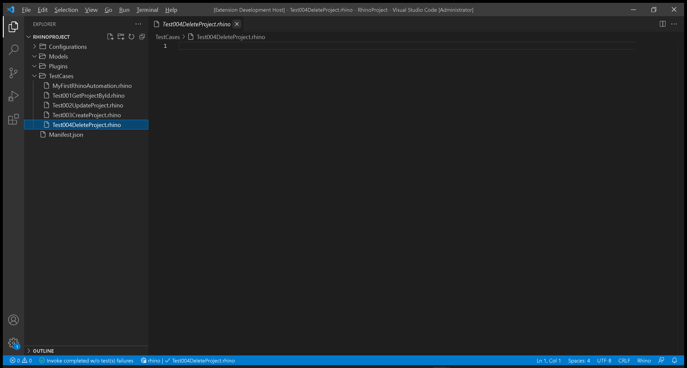
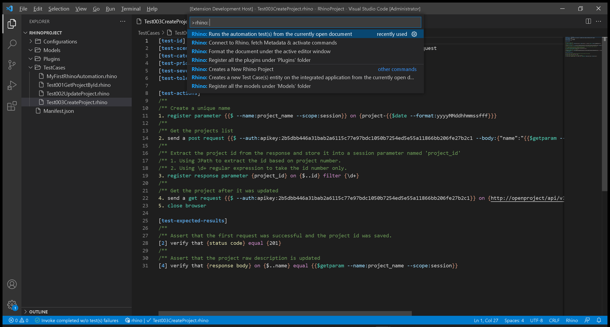
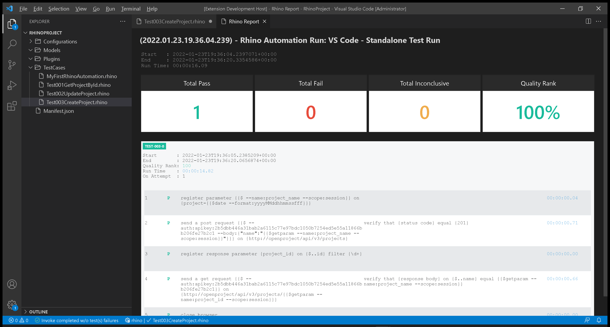

# Test 004: API - Delete Project

:arrow_backward: [Previous](./03.InterceptAndReplicateAPICalls.md) Unit 4 of 10 [Next](uu) :arrow_forward:

35 min · Unit · [Roei Sabag](https://www.linkedin.com/in/roei-sabag-247aa18/) · Level ★★★★☆
  
The test will verify that a new project with a random unique name was created and deleted according to data sent by the test.  

## Prerequisites

1. Change the `driver` value under `Manifest.json` file from `ChromeDriver` to `MockWebDriver`.
2. Change the `driverBinaries` value under `Manifest.json` from `http://selenoid:4444/wd/hub` to `.`.
3. You have created an api token, if you have not, [please follow these instructions](./01.SetupOpenProjectApplication.md).

## Test Implementation

> :information_source: **Information**
>  
> The implementation of this test will be done in 3 phases.
>
> 1. Create a new project with a unique name.
> 2. Save the new project id into a parameter called `project_id`.
> 3. Use the `project_id` parameter to send `DeleteProject` request.  

1. Right click on `TestCases` folder.
2. Select `New File`.  
3. Name your file `Test004DeleteProject.rhino`.
4. Click on `Test004DeleteProject.rhino` file to open it.  

  
_**image 1.1 - New File Context Item**_  


1. Type in the following test.  

```cmd
[test-id]         TEST-003
[test-scenario]   verify that a new project is updated when sending CreateProject API request
[test-categories] API
[test-priority]   1 - critical
[test-severity]   1 - critical
[test-tolerance]  0%

[test-actions]
/**
/** Create a unique name
1. register parameter {{$ --name:project_name --scope:session}} on {project-{{$date --format:yyyyMMddhhmmssfff}}}
/**
/** Get the projects list
2. send a post request {{$ --auth:apikey:2b5dbb446a31bab2a6115c77e97bdc1050b7254ed5e55a11866bb206fe27b2c1 --body:{"name":"{{$getparam --name:project_name --scope:session}}"}}} on {http://openproject/api/v3/projects}
/**
/** Extract the project id from the response and store it into a session parameter named 'project_id'
/** 1. Using JPath to extract the id based on project number.
/** 2. Using \d+ regular expression to take the id number only.
3. register response parameter {project_id} on {$..id} filter {\d+}
/**
/** Get the project after it was updated
4. send a get request {{$ --auth:apikey:2b5dbb446a31bab2a6115c77e97bdc1050b7254ed5e55a11866bb206fe27b2c1}} on {http://openproject/api/v3/projects/{{$getparam --name:project_id --scope:session}}}
5. close browser

[test-expected-results]
/**
/** Assert that the first request was successful and the project id was saved.
[2] verify that {status code} equal {201}
/**
/** Assert that the project raw description is updated
[4] verify that {response body} on {$..name} equal {{$getparam --name:project_name --scope:session}}
```  

## Run your Test

Rhino can run the test file directly from `Visual Studio Code`, by executing the invoke command.  

> :information_source: **Information**
>  
> Selenoid allows you to see your test in runtime and also takes a video of your test.

1. Open command palette by pressing `CTRL`+`SHIFT`+`P`.
2. Type `Rhino` to find Rhino Commands.
3. Select and run the command `Rhino: Runs the automation test(s) from the currently open document`.
4. A progress indication will show in `Visual Studio Code` status bar.  


_**image 1.2 - Command Palette**_  

When test invocation is complete, a report will be opened under a new `Visual Studio Code` tab.  


_**image 1.3 - Rhino Report**_
