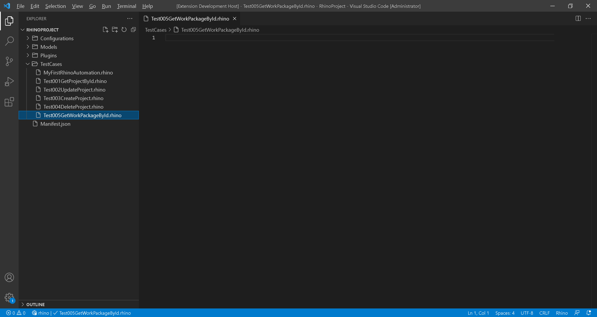
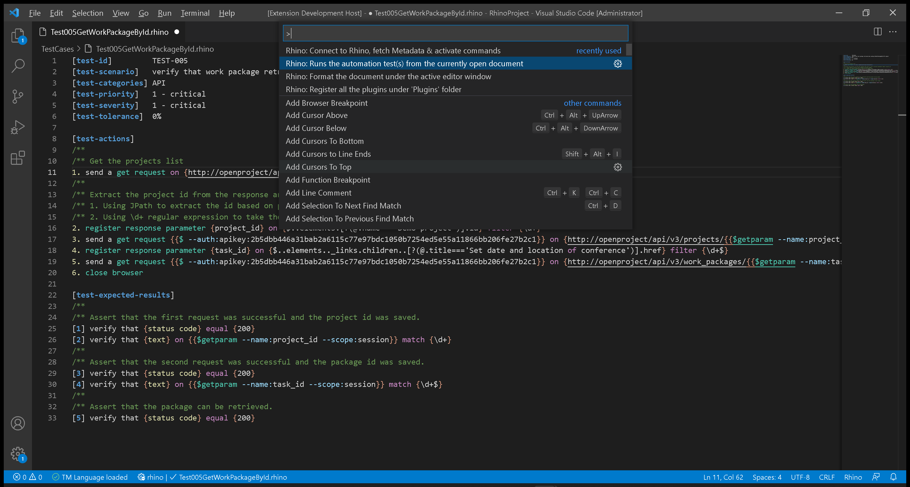
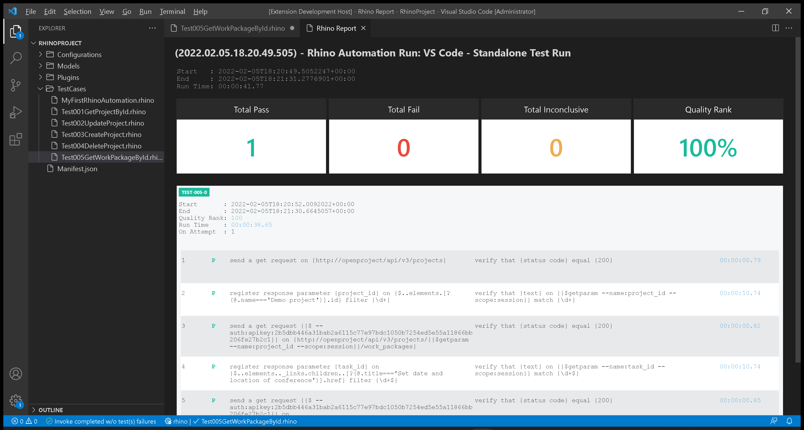

# Test 001: API - Get Project by ID

:arrow_backward: [Previous](./07.Test004DeleteProject.md) Unit 7 of 10 [Next](./09.Test006UpdateWorkPackage.md) :arrow_forward:

35 min · Unit · [Roei Sabag](https://www.linkedin.com/in/roei-sabag-247aa18/) · Level ★★☆☆☆
  
The test will verify that a task work package by the name `Set date and location of conference` already exists under 'Demo Project' and can be retrieved using `Open Project API`.  

## Prerequisites

1. A project named `Demo Project` already exists. Follow [Setup Environment](../Tutorials.SetupEnvironment/00.Module.md) if it does not.
2. A task work package named `Set date and location of conference` already exists. Follow [Setup Environment](../Tutorials.SetupEnvironment/00.Module.md) if it does not.
3. Change the `driver` value under `Manifest.json` file from `ChromeDriver` to `MockWebDriver`.
4. Change the `driverBinaries` value under `Manifest.json` from `http://selenoid:4444/wd/hub` to `.`

## Test Implementation

> :information_source: **Information**
>  
> The implementation of this test will be done in 4 phases.
>
> 1. Get `Demo Project` id from the projects list.
> 2. Use `Demo Project` id from the projects list to with `GetWorkPackages` requests.  
> 3. Get `Set date and location of conference` id from the `Work Packages` list.
> 4. Use `Set date and location of conference` id from the projects list to send `GetWorkPackageById` request.  

1. Right click on `TestCases` folder.
2. Select `New File`.
3. Name your file `Test005GetWorkPackageById.rhino`.
4. Click on `Test005GetWorkPackageById.rhino` file to open it.  

  
_**image 2.1 - New File Context Item**_  

1. Type in the following test.

```rhino
[test-id]         TEST-006
[test-scenario]   verify that work package retrieved when sending GetWorkPackageById API request
[test-categories] API
[test-priority]   1 - critical
[test-severity]   1 - critical
[test-tolerance]  0%

[test-actions]
/**
/** Get the projects list
1. send a get request on {http://openproject/api/v3/projects}
/**
/** Extract the project id from the response and store it into a session parameter named 'project_id'
/** 1. Using JPath to extract the id based on project number.
/** 2. Using \d+ regular expression to take the id number only.
2. register response parameter {project_id} on {$..elements.[?(@.name==='Demo project')].id} filter {\d+}
3. send a get request {{$ --auth:apikey:2b5dbb446a31bab2a6115c77e97bdc1050b7254ed5e55a11866bb206fe27b2c1}} on {http://openproject/api/v3/projects/{{$getparam --name:project_id --scope:session}}/work_packages}
4. register response parameter {task_id} on {$..elements.._links.children..[?(@.title==='Set date and location of conference')].href} filter {\d+$}
5. send a get request {{$ --auth:apikey:2b5dbb446a31bab2a6115c77e97bdc1050b7254ed5e55a11866bb206fe27b2c1}} on {http://openproject/api/v3/work_packages/{{$getparam --name:task_id --scope:session}}}
6. close browser

[test-expected-results]
/**
/** Assert that the first request was successful and the project id was saved.
[1] verify that {status code} equal {200}
[2] verify that {text} on {{$getparam --name:project_id --scope:session}} match {\d+}
/**
/** Assert that the second request was successful and the package id was saved.
[3] verify that {status code} equal {200}
[4] verify that {text} on {{$getparam --name:task_id --scope:session}} match {\d+$}
/**
/** Assert that the package can be retrieved.
[5] verify that {status code} equal {200}
```

## Run your Test

Rhino can run the test file directly from `Visual Studio Code`, by executing the invoke command.  

> :information_source: **Information**
>  
> Selenoid allows you to see your test in runtime and also takes a video of your test.

1. Open command palette by pressing `CTRL`+`SHIFT`+`P`.
2. Type `Rhino` to find Rhino Commands.
3. Select and run the command `Rhino: Runs the automation test(s) from the currently open document`.
4. A progress indication will show in `Visual Studio Code` status bar.  


_**image 1.1 - Command Palette**_  

When test invocation is complete, a report will be opened under a new `Visual Studio Code` tab.  


_**image 1.2 - Rhino Report**_  

## Breakdown

### Test Metadata

The test metadata holds an important information about your test. There are many metadata fields and it can also use custom fields which are directly derived from your `Application Lifecycle Manager` (e.g., Jira, Azure DevOps, Test Rail, XRay, etc.).

| Field           | Meaning                                                                                                                                  |
|-----------------|------------------------------------------------------------------------------------------------------------------------------------------|
| test-id         | The unique identifier of the test. Please note the Rhino **will distinct** tests by their ID.                                            |
| test-scenario   | A statement describing the functionality to be tested.                                                                                   |
| test-categories | A comma separated list of categories (also refers as 'Tags' or 'Marks') to which this test belongs to.                                   |
| test-priority   | The level of **business importance** assigned to an item, e.g., defect.                                                                  |
| test-severity   | The degree of **impact** that a defect has on the development or operation of a component or system.                                     |
| test-tolerance  | The % of the test tolerance. A Special attribute to decide, based on configuration if the test will be marked as passed or with warning. |

### Test Actions

The numbers beside each action does not have any affect on the test itself and were designed to increase the test readability and to make it easier to assign expected results for each action based on the action positional location.  

**Actions (Plugins) Call:**  

1. `get request` - sends an HTTP `GET` request to `OpenProject` server on address `http://openproject/api/v3/projects` to get all the available projects.
2. `register response parameter` - gets the project id value by using [JPath (JSON Path)](https://goessner.net/articles/JsonPath/) on the response body from the previous request.
3. `get request` - sends an HTTP `GET` request to `OpenProject` server on address `http://openproject/api/v3/projects/<project_id>/work_packages` to get all the available work packages.
4. `register response parameter` - gets the work package id value by using [JPath (JSON Path)](https://goessner.net/articles/JsonPath/) on the response body from the previous request.
5. `get request` - sends an HTTP `GET` request to `OpenProject` server on address `http://openproject/api/v3/work_packages/<task_id>` to get a task entity by using the `task_id` parameter from the previous request.
6. `close browser` - closes the current driver session, without it the driver session will remain available until the next `Rhino API` restart.

### Test Expected Results

The numbers beside each expected result points to the action it asserts based on the action positional under `[test-actions]` section. It is possible to point multiple assertions to the same action.  

**Actions (Plugins) Call:**

1. `status code` - asserts that HTTP StatusCode that was returned by the last first `GET` request action is `200`.
2. `text` - asserts that the `project_id` parameter value is a number (e.g., match `\d+`).
3. `getparam` - when used within a CLI block (e.g., blocks that starts with `{{$` and ends with `}}`) it will retrieve a parameter by the parameter name and the parameter scope, in our case, the parameter we saved with the project id value. In conjunction with `text` assertion we can evaluate the `project_id` parameter value.
4. `status code` - asserts that HTTP StatusCode that was returned by the last first `GET` request action is `200`.
5. `text` - asserts that the `task_id` parameter value is a number (e.g., match `\d+`).
6. `getparam` - when used within a CLI block (e.g., blocks that starts with `{{$` and ends with `}}`) it will retrieve a parameter by the parameter name and the parameter scope, in our case, the parameter we saved with the project id value. In conjunction with `text` assertion we can evaluate the `task_id` parameter value.
7. `status code` - asserts that HTTP StatusCode that was returned by the last first `GET` request action is `200`, meaning the `Task` was found and retrieved.

### Next Unit: Test 009 - Update Work Package

### :arrow_forward: [Continue](./09.Test006UpdateWorkPackage.md)
