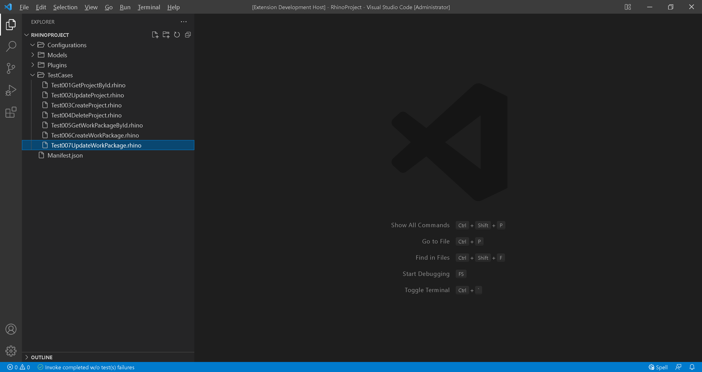
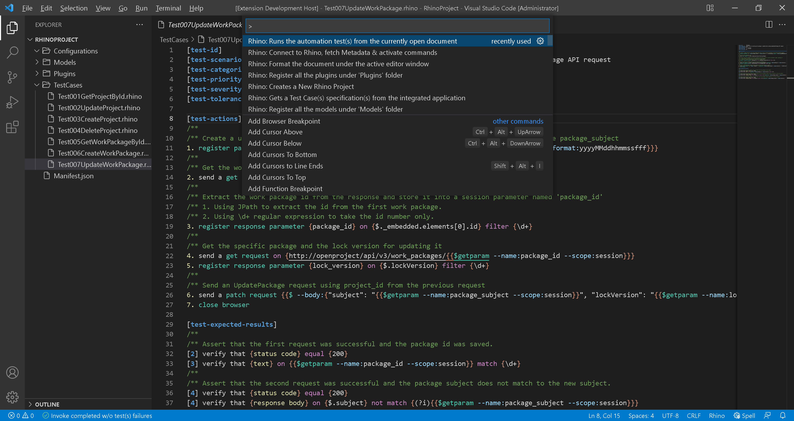
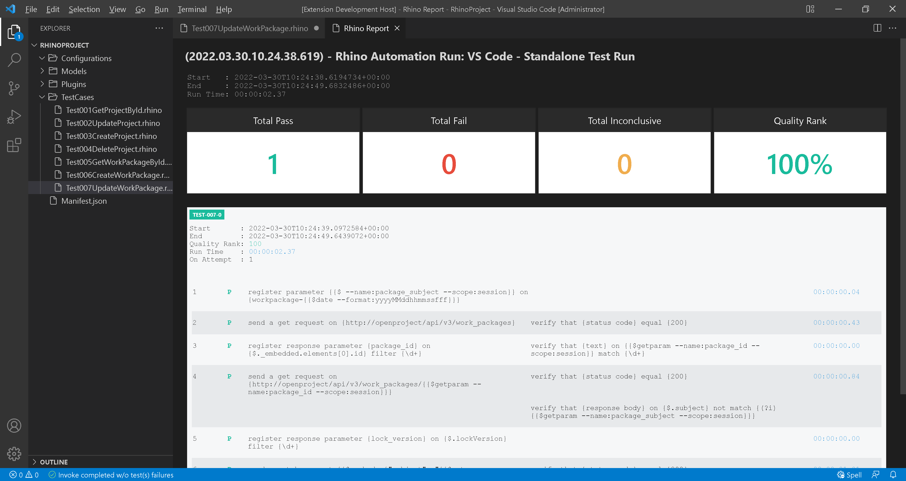

# Test 007: API - Update Work Package

:arrow_backward: [Previous](09.Test006CreateWorkPackage.md) Unit 10 of 10 [Next](./10.Test007UpdateWorkPackage.md) :arrow_forward:

35 min · Unit · [Roei Sabag](https://www.linkedin.com/in/roei-sabag-247aa18/) · Level ★★☆☆☆
  
The test will verify that an existing `Work Package` can be updated.  

## Prerequisites

1. A project named `Demo Project` already exists. Follow [Setup Environment](../Tutorials.SetupEnvironment/00.Module.md) if it does not.
2. Change the `driver` value under `Manifest.json` file from `ChromeDriver` to `MockWebDriver`.
3. Change the `driverBinaries` value under `Manifest.json` from `http://selenoid:4444/wd/hub` to `.`.
4. You have created an api token, if you have not, [please follow these instructions](./01.SetupOpenProjectApplication.md).

## Test Implementation

> :information_source: **Information**
>  
> When calling this endpoint the client provides a single object, containing the properties and links that it wants to change, in the body.
> Note that it is only allowed to provide properties or links supporting the write operation.
>  
> Additionally to the fields the client wants to change, it is mandatory to provide the value of lockVersion which was received by the GET
> request this change originates from.
>  
> The value of lockVersion is used to implement [optimistic locking](https://en.wikipedia.org/wiki/Optimistic_concurrency_control).
>  
> The implementation of this test will be done in 4 phases.
>
> 1. Get the first `Work Package` id from the packages list.
> 2. Save the `Work Package` id into a parameter called `package_id`.
> 3. Get the `Work Package` lock version and save it into a parameter called `lock_version`.
> 4. Update the `subject` filed of the `Work Pages`.  

1. Right click on `TestCases` folder.
2. Select `New File`.  
3. Name your file `Test007UpdateWorkPackage.rhino`.
4. Click on `Test007UpdateWorkPackage.rhino` file to open it.  

  
_**image 1.1 - New File Context Item**_  

1. Type in the following test.  

```cmd
[test-id]         TEST-007
[test-scenario]   verify that an existing work package is updated when sending UpdateWorkPackage API request
[test-categories] API
[test-priority]   1 - critical
[test-severity]   1 - critical
[test-tolerance]  0%

[test-actions]
/**
/** Create a unique name for the work package and save it into a session parameter by the name package_subject
1. register parameter {{$ --name:package_subject --scope:session}} on {workpackage-{{$date --format:yyyyMMddhhmmssfff}}}
/**
/** Get the work packages list
2. send a get request on {http://openproject/api/v3/work_packages}
/**
/** Extract the work package id from the response and store it into a session parameter named 'package_id'
/** 1. Using JPath to extract the id from the first work package.
/** 2. Using \d+ regular expression to take the id number only.
3. register response parameter {package_id} on {$._embedded.elements[0].id} filter {\d+}
/**
/** Get the specific package and the lock version for updating it
4. send a get request on {http://openproject/api/v3/work_packages/{{$getparam --name:package_id --scope:session}}}
5. register response parameter {lock_version} on {$.lockVersion} filter {\d+}
/**
/** Send an UpdatePackage request using project_id from the previous request
6. send a patch request {{$ --body:{"subject": "{{$getparam --name:package_subject --scope:session}}", "lockVersion": "{{$getparam --name:lock_version --scope:session}}"} --auth:apikey:73b1c1414976fe9d9635597c23bb57b15d3e799f534fffd7debd01a87f482afe}} on {http://openproject/api/v3/work_packages/{{$getparam --name:package_id --scope:session}}}
7. close browser

[test-expected-results]
/**
/** Assert that the first request was successful and the package id was saved.
[2] verify that {status code} equal {200}
[3] verify that {text} on {{$getparam --name:package_id --scope:session}} match {\d+}
/**
/** Assert that the second request was successful and the package subject does not match to the new subject.
[4] verify that {status code} equal {200}
[4] verify that {response body} on {$.subject} not match {(?i){{$getparam --name:package_subject --scope:session}}}
/**
/** Assert that the third request was successful and the package subject matches to the new subject.
[6] verify that {status code} equal {200}
[6] verify that {response body} on {$.subject} match {(?i){{$getparam --name:package_subject --scope:session}}}
```  

## Run your Test

Rhino can run the test file directly from `Visual Studio Code`, by executing the invoke command.  

1. Open command palette by pressing `CTRL`+`SHIFT`+`P`.
2. Type `Rhino` to find Rhino Commands.
3. Select and run the command `Rhino: Runs the automation test(s) from the currently open document`.
4. A progress indication will show in `Visual Studio Code` status bar.  


_**image 1.2 - Command Palette**_  

When test invocation is complete, a report will be opened under a new `Visual Studio Code` tab.  


_**image 1.3 - Rhino Report**_  

## Breakdown

### Test Metadata

The test metadata holds an important information about your test. There are many metadata fields and it can also use custom fields which are directly derived from your `Application Lifecycle Manager` (e.g., Jira, Azure DevOps, Test Rail, XRay, etc.).

| Field           | Meaning                                                                                                                                  |
|-----------------|------------------------------------------------------------------------------------------------------------------------------------------|
| test-id         | The unique identifier of the test. Please note the Rhino **will distinct** tests by their ID.                                            |
| test-scenario   | A statement describing the functionality to be tested.                                                                                   |
| test-categories | A comma separated list of categories (also refers as 'Tags' or 'Marks') to which this test belongs to.                                   |
| test-priority   | The level of **business importance** assigned to an item, e.g., defect.                                                                  |
| test-severity   | The degree of **impact** that a defect has on the development or operation of a component or system.                                     |
| test-tolerance  | The % of the test tolerance. A Special attribute to decide, based on configuration if the test will be marked as passed or with warning. |

### Test Actions

The numbers beside each action does not have any affect on the test itself and were designed to increase the test readability and to make it easier to assign expected results for each action based on the action positional location.  

**Actions (Plugins) Call:**  

1. `register parameter` - creates a `package_subject` parameter which is composed of a static string `workpackage-` and a unique, date-time based number (e.g., workpackage-20220127190947989).
2. `send get request` - sends an HTTP `GET` request to `OpenProject` server on address `http://openproject/api/v3/work_packages` to get a list of all work packages.
3. `register response parameter` - gets the first work package id value by using [JPath (JSON Path)](https://goessner.net/articles/JsonPath/) on the response body from the previous request.
4. `send get request` - sends an HTTP `GET` request to `OpenProject` server on address `http://openproject/api/v3/work_packages/<id>` to get the information of the first work package found.
5. `register response parameter` - gets the lock version value by using [JPath (JSON Path)](https://goessner.net/articles/JsonPath/) on the response body from the previous request.
6. `send patch request` - sends an HTTP `PATCH` request to `OpenProject` server on address `http://openproject/api/v3/work_packages/<id>` to update the work package with a new subject.

### Test Expected Results

The numbers beside each expected result points to the action it asserts based on the action positional under `[test-actions]` section. It is possible to point multiple assertions to the same action.  

**Actions (Plugins) Call:**  

1. `status code` - asserts that the HTTP StatusCode that was returned by the last `GET` request action is `200`.
2. `text` - asserts that the value saved under `package_id` parameter is a number.
3. `status code` - asserts that the HTTP StatusCode that was returned by the last `GET` request action is `200`.
4. `response body` - asserts that the package `subject` found by the given [JPath (JSON Path)](https://goessner.net/articles/JsonPath/) in the response body of the previous request does not match to the value we want to update it to (the future value).
5. `status code` - asserts that the HTTP StatusCode that was returned by the last `GET` request action is `200`.
6. `response body` - asserts that the package `subject` found by the given [JPath (JSON Path)](https://goessner.net/articles/JsonPath/) in the response body of the previous request match to the new value.

### Next Unit: Test 007 - Update Work Package

### :arrow_forward: [Continue](./10.Test007UpdateWorkPackage.md)
