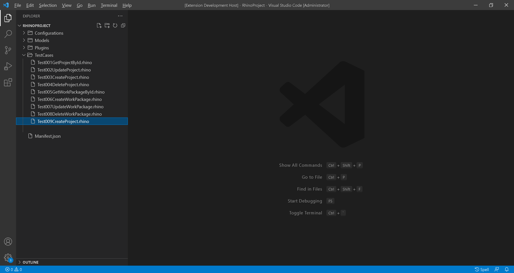
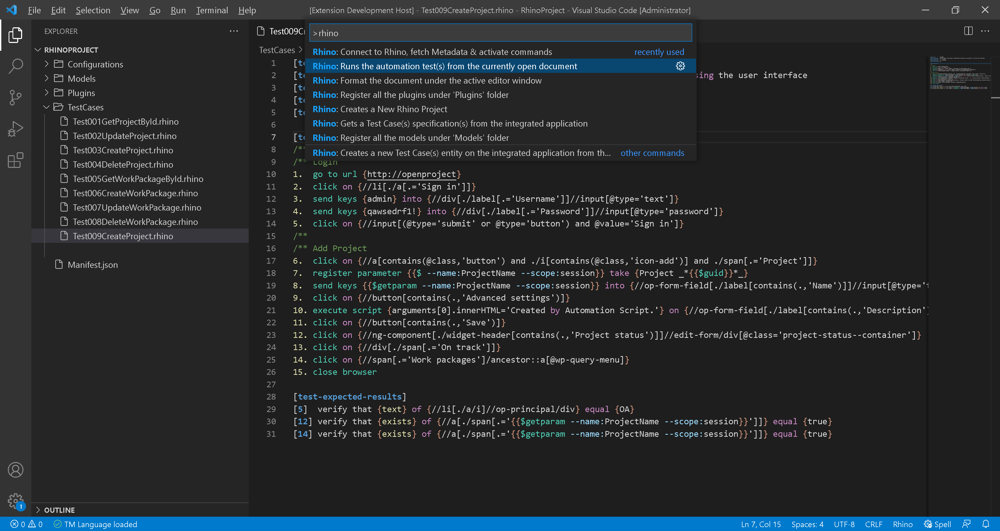
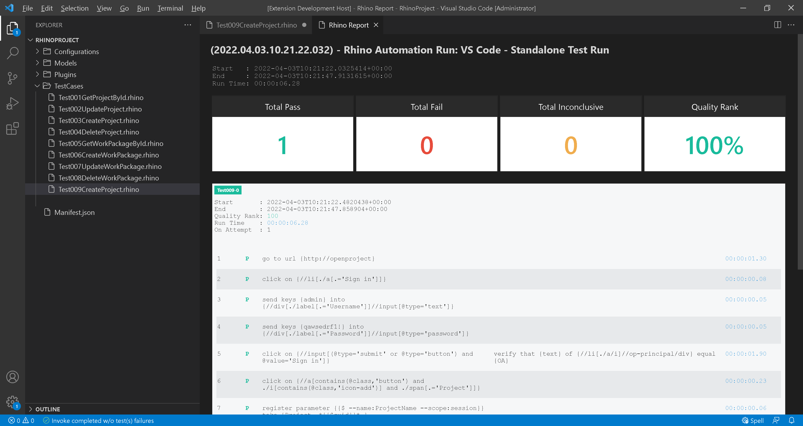

# Test 009: UI - Create Project

:arrow_backward: [Previous](./11.Test008DeleteWorkPackage.md) Unit 12 of 14 [Next](./13.Test010CreateTask.md) :arrow_forward:

35 min · Unit · [Roei Sabag](https://www.linkedin.com/in/roei-sabag-247aa18/) · Level ★★☆☆☆
  
The test will verify that a new project with a random unique name was created according to data sent by the test.  

## Prerequisites

- [X] Change the `driver` value under `Manifest.json` file from `MockWebDriver` to `ChromeDriver`.
- [X] Change the `driverBinaries` value under `Manifest.json` from `.` to `http://selenoid:4444/wd/hub`.
- [X] You can access the application using a username and password. If you cannot, [please follow these instructions](./01.SetupOpenProjectApplication.md).

## Test Implementation

> :information_source: **Information**
>  
> The implementation of this test will be done in 3 phases.
>
> 1. Login to _**Open Project**_ application.
> 2. Create a new project using a unique name.
> 3. Verify that the new project created based on the unique project name.  

1. Right click on `TestCases` folder.
2. Select `New File`.  
3. Name your file `Test009CreateProject.rhino`.
4. Click on `Test009CreateProject.rhino` file to open it.  

  
_**image 1.1 - New File Context Item**_  

1. Type in the following test.  

```cmd
[test-id]         Test009
[test-scenario]   verify that a new project created when creating a new project using the user interface
[test-priority]   1 - critical
[test-severity]   1 - critical
[test-tolerance]  0%

[test-actions]
/**
/** Login
1.  go to url {http://openproject}
2.  click on {//li[./a[.='Sign in']]}
3.  send keys {admin} into {//div[./label[.='Username']]//input[@type='text']}
4.  send keys {qawsedrf1!} into {//div[./label[.='Password']]//input[@type='password']}
5.  click on {//input[(@type='submit' or @type='button') and @value='Sign in']}
/**
/** Add Project
6.  click on {//a[contains(@class,'button') and ./i[contains(@class,'icon-add')] and ./span[.='Project']]}
7.  register parameter {{$ --name:ProjectName --scope:session}} take {Project _*{{$guid}}*_}
8.  send keys {{$getparam --name:ProjectName --scope:session}} into {//op-form-field[./label[contains(.,'Name')]]//input[@type='text']}
9.  click on {//button[contains(.,'Advanced settings')]}
10. execute script {arguments[0].innerHTML='Created by Automation Script.'} on {//op-form-field[./label[contains(.,'Description')]]//div[@role='textbox']/p}
11. click on {//button[contains(.,'Save')]}
12. click on {//ng-component[./widget-header[contains(.,'Project status')]]//edit-form/div[@class='project-status--container']}
13. click on {//div[./span[.='On track']]}
14. click on {//span[.='Work packages']/ancestor::a[@wp-query-menu]}
15. close browser

[test-expected-results]
[5]  verify that {text} of {//li[./a/i]//op-principal/div} equal {OA}
[12] verify that {exists} of {//a[./span[.='{{$getparam --name:ProjectName --scope:session}}']]} equal {true}
[14] verify that {exists} of {//a[./span[.='{{$getparam --name:ProjectName --scope:session}}']]} equal {true}
```  

## Run your Test

Rhino can run the test file directly from `Visual Studio Code`, by executing the invoke command.  

1. Open command palette by pressing `CTRL`+`SHIFT`+`P`.
2. Type `Rhino` to find Rhino Commands.
3. Select and run the command `Rhino: Runs the automation test(s) from the currently open document`.
4. A progress indication will show in `Visual Studio Code` status bar.  


_**image 1.2 - Command Palette**_  

When test invocation is complete, a report will be opened under a new `Visual Studio Code` tab.  


_**image 1.3 - Rhino Report**_  

## Breakdown

### Test Metadata

The test metadata holds an important information about your test. There are many metadata fields and it can also use custom fields which are directly derived from your `Application Lifecycle Manager` (e.g., Jira, Azure DevOps, Test Rail, XRay, etc.).

| Field           | Meaning                                                                                                                                  |
|-----------------|------------------------------------------------------------------------------------------------------------------------------------------|
| test-id         | The unique identifier of the test. Please note the Rhino **will distinct** tests by their ID.                                            |
| test-scenario   | A statement describing the functionality to be tested.                                                                                   |
| test-categories | A comma separated list of categories (also refers as 'Tags' or 'Marks') to which this test belongs to.                                   |
| test-priority   | The level of **business importance** assigned to an item, e.g., defect.                                                                  |
| test-severity   | The degree of **impact** that a defect has on the development or operation of a component or system.                                     |
| test-tolerance  | The % of the test tolerance. A Special attribute to decide, based on configuration if the test will be marked as passed or with warning. |

### Test Actions

The numbers beside each action does not have any affect on the test itself and were designed to increase the test readability and to make it easier to assign expected results for each action based on the action positional location.  

**Actions (Plugins) Call:**  

1. `go to url` - Load _**Open Project**_ application in the current browser window. This is done using an HTTP GET operation and the method will block until the load is complete.
2. `click` - Clicks the mouse on the `Sign in` button.
3. `send keys` - Type `admin` into `Username` text-box under the `Sign in` panel.
4. `send keys` - Type `qawsedrf1!` into `Password` text-box under the `Sign in` panel.
5. `click` - Clicks the mouse the `Sign in` button under the `Sign in` panel.
6. `click` - Clicks the mouse the `Add Project` button near the projects list under the top panel.
7. `register parameter` - Creates a new, unique project name and save into `ProjectName` session parameter.
8. `send keys` - Type `ProjectName` parameter value into `Project Name` text-box under the `Sign in` panel.
9. `click` - Clicks the mouse on `Advanced Settings` panel header (will expand the panel).
10. `execute script` - Type `asdf` into the `Description` text-box. We are using `Execute Script` as a workaround to a situation when conventional methods (e,g. `SendKeys` do not work or the controller does not support typing).
11. `click` - Clicks the mouse on `Save` button on the bottom left side of the screen.
12. `click` - Clicks the mouse on `Project Status` list under `Project Status` widget.
13. `click` - Clicks the mouse on `On Track` list-item under `Project Status` list.
14. `click` - Clicks the mouse on `Work Packages` menu-item under the side navigation panel.
15. `close browser` - Close the browser session.

### Test Expected Results

The numbers beside each expected result points to the action it asserts based on the action positional under `[test-actions]` section. It is possible to point multiple assertions to the same action.  

**Actions (Plugins) Call:**  

1. `text` - asserts that the inner-text of the user panel is `OA`, which means that the login was successful.
2. `exists` - asserts that the name of the project exists under the projects list on the top left corner of the screen.
3. `exists` - asserts that the name of the project exists under the projects list on the top left corner of the screen, after navigating to work packages screen.

### Next Unit: "Test 010: UI - Create Task"

[Continue](./13.Test010CreateTask.md) :arrow_forward:
