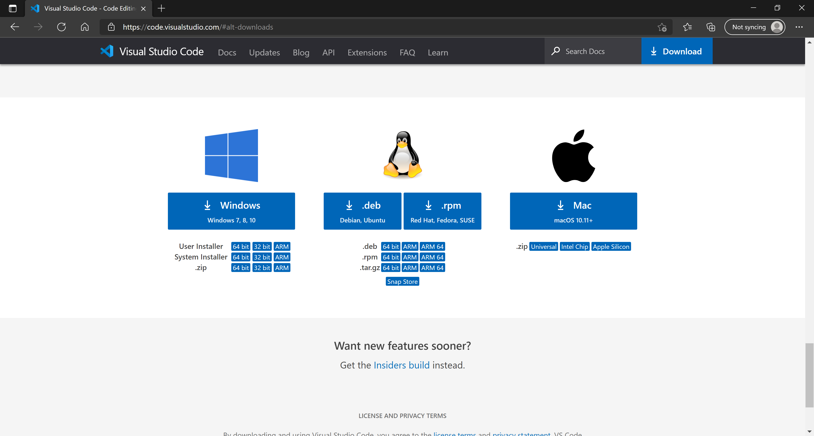
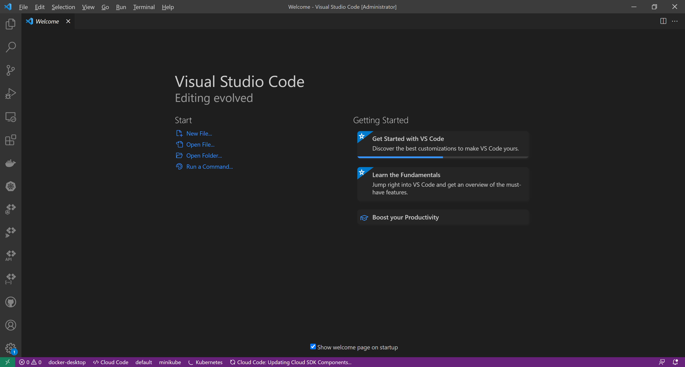

[◂ Previous](./00.Module.md) Unit 1 of 10 [Next ▸](./02.InstallRhinoAPILanguageSupportPlugin.md)

# Install Visual Studion Code
10 min · Unit · [Roei Sabag](https://www.linkedin.com/in/roei-sabag-247aa18/)

Visual Studio Code is a lightweight but powerful source code editor which runs on your desktop and is available for Windows, macOS and Linux.  

> :information_source:  
> 
> In this unit we will be using the `.zip/.tar.gz` archive method to install Visual Studion Code.
  
## Download
1. Navigate to [Visual Studio Code - Code Editing. Redefined](https://code.visualstudio.com/#alt-downloads).  
2. Download the appropriate Visual Studio Code `.zip/.tar.gz` that suites to your operating system.  

  
_**image 1.1 - visual studio Code download page**_

## Deploy
1. Extract the `.zip/.tar.gz` archive.
2. Navigate under the folder where you have extracted the `.zip/.tar.gz` archive.
3. Run Visual Studio Code executable file (e.g. Code.exe or Code).  

  
_**image 2.1 - visual studio Code**_

---
### Next unit: Install Rhino API Language Support Plugin
### [Continue ▸](./02.InstallRhinoAPILanguageSupportPlugin.md)
---
