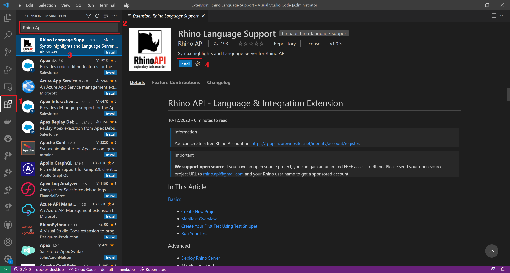

[◂ Previous](./01.InstallVisualStudioCode.md) Unit 2 of 10 [Next ▸](./03.InstallPostman.md)

# Install Rhino API Language Support
2 min · Unit · [Roei Sabag](https://www.linkedin.com/in/roei-sabag-247aa18/)

Rhino Language Support Extension, allows to get Rhino metadata from Rhino API and parse it into a rubust language for writing Rhino Specs. It allows auto-complete, snippets, API commands and reports.
  
## Installation
1. Open Visual Studio Code.
2. Click on **Extensions** icon on the right menu bar.
3. Type **Rhino Language Support** into **Search Extensions** text-box under **Extensions** panel.
4. Click on **Rhino Language Extension** list-item under **Extensions** panel.
5. Click on **Install** button under **Rhino Language Support** panel.

  
_**image 1.1 - Visual Studio Code Extensions**_

---
### Next unit: Install Postman
### [Continue ▸](./03.InstallPostman.md)
---
