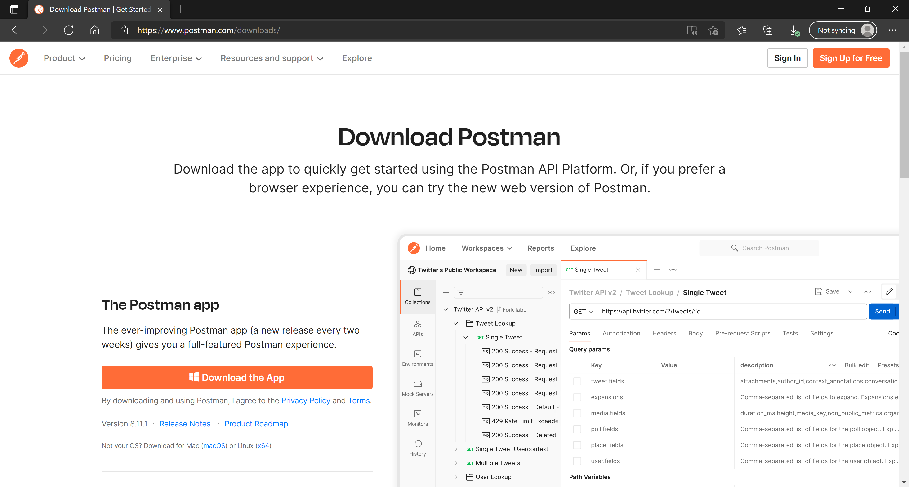

[◂ Previous](./02.InstallRhinoLanguageExtension.md) Unit 3 of 10 [Next ▸]()

# Install Postman
2 min · Unit · [Roei Sabag](https://www.linkedin.com/in/roei-sabag-247aa18/)

Postman is an API platform for building and using APIs.
  
## Installation
1. Navigate to [https://www.postman.com/downloads/](https://www.postman.com/downloads/)
2. Download the Postman Application sutiable for your operating system.
3. Run the installation file.
4. Follow the installation instrcutions (if any) provided by Postman.

  
_**image 1.1 - Postman Download Page**_

---
### Next unit: 
### [Continue ▸]()
---