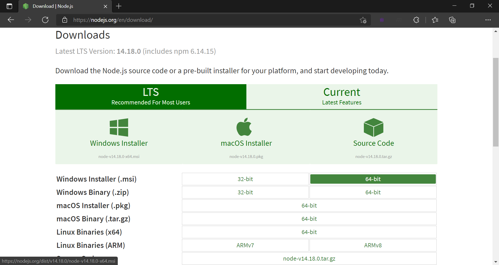
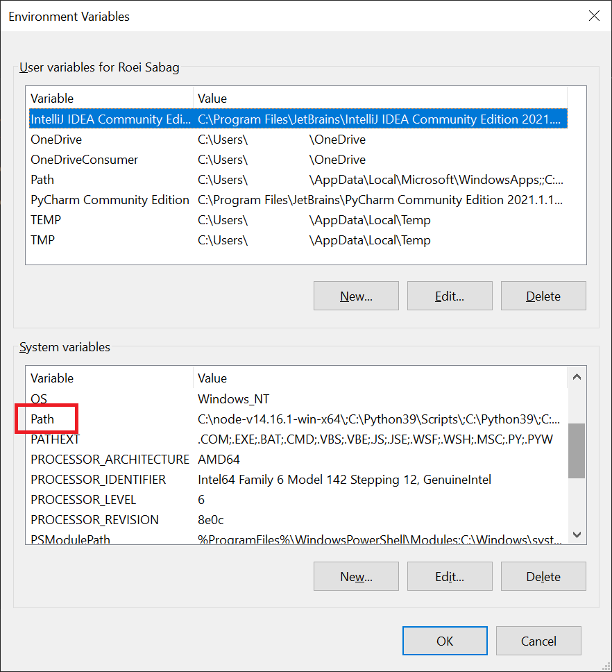
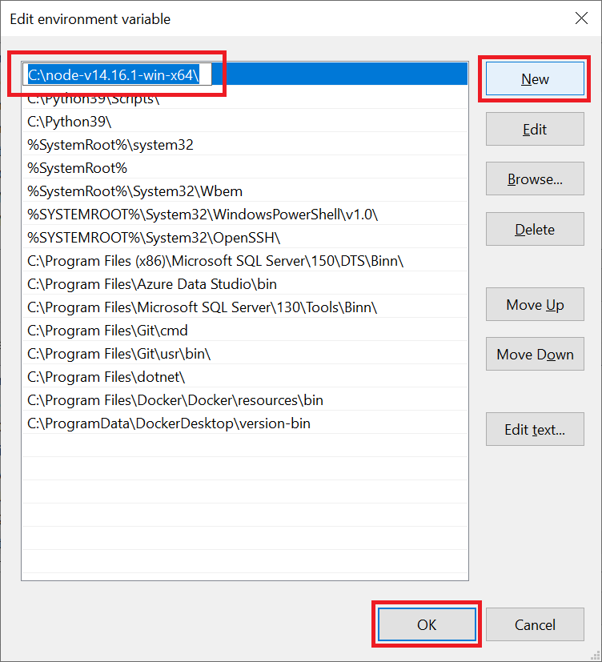

[◂ Previous](./03.InstallPostman.md) Unit 4 of 10 [Next ▸](./05.InstallNewman.md)

# Install Node.js
2 min · Unit · [Roei Sabag](https://www.linkedin.com/in/roei-sabag-247aa18/) · Level ★★☆☆☆

As an asynchronous event-driven JavaScript runtime, Node.js is designed to build scalable network applications.
  
## Basic Installation
1. Navigate to [https://nodejs.org/en/download/](https://nodejs.org/en/download/)
2. Download the Node.js installation suitable for your operating system.
3. Run the installation file.
4. Follow the installation instructions (if any) provided by Node.js.

  
_**image 1.1 - Node.js Download Page**_

## Add to Path
### Windows
1. Press on _⊞_ (Windows Key).
2. Type `cmd`.
3. Right click on `Command Prompt` icon ▸ "Run as administrator"
4. Type `rundll32 sysdm.cpl,EditEnvironmentVariables` into the command prompt.
5. Find `Path` under `System variables` section.
6. Double click on `Path` variable, or select `Path` variable and click on `Edit...` button.

  
_**image 2.1 - Windows Environment Parameters**_  

7. Click on `New` button.
8. Type in the full path under which you have installed Node.js.
9. Click on `OK` button.  

  
_**image 2.2 - Windows Path Dialog**_  

### Linux
1. Connect or open the terminal.
2. Type `export PATH="<Full path to Node.js folder>:$PATH"` into the terminal prompt.

### MacOS
1. Open up Terminal.
2. Run the command `sudo nano /etc/paths`.
3. Type your password, when prompted.
4. Type the path you wish to add at the bottom of the file.
5. Click `CTRL`-`X` to quit.
6. Type `Y` to save the modifications.

---
### Next Unit: Install Newman
### [Continue ▸](./05.InstallNewman.md)
---