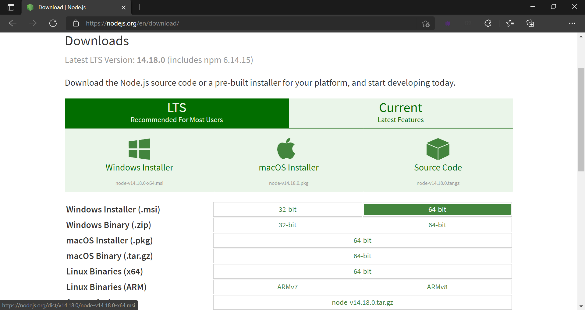

[◂ Previous](./04.InstallNodeJs.md) Unit 5 of 10 [Next ▸](./05.InstallNewman.md)

# Newman Command-Line Collection
2 min · Unit · [Roei Sabag](https://www.linkedin.com/in/roei-sabag-247aa18/) · Level ★☆☆☆☆

Newman is a command-line Collection Runner for Postman. It enables you to run and test a Postman Collection directly from the command line. It is built with extensibility in mind so that you can easily integrate it with your continuous integration servers and build systems.
  
## Basic Installation
1. Navigate to [https://nodejs.org/en/download/](https://nodejs.org/en/download/)
2. Download the Node.js installation suitable for your operating system.
3. Run the installation file.
4. Follow the installation instructions (if any) provided by Node.js.

  
_**image 1.1 - Node.js Download Page**_

---
### Next Unit: Install Newman
### [Continue ▸](./05.InstallNewman.md)
---