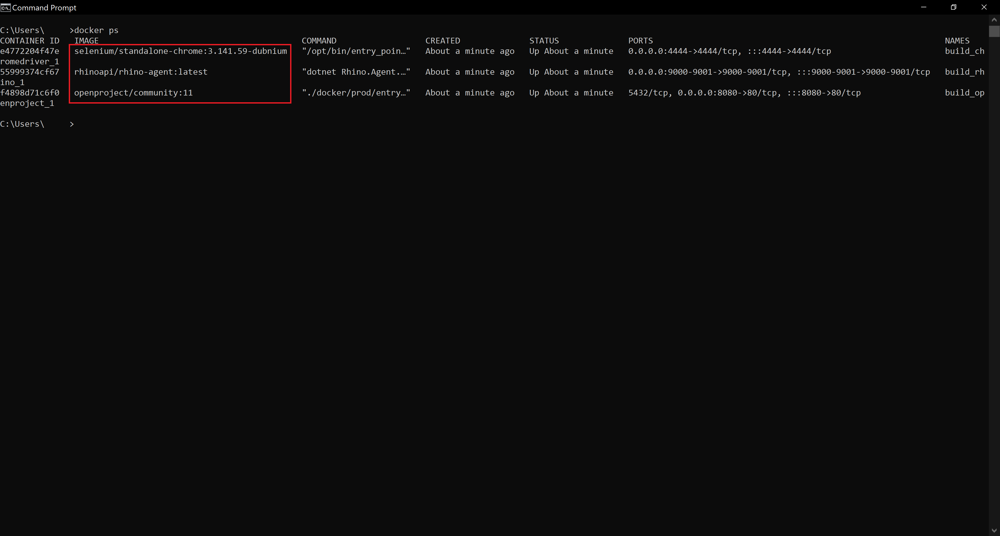

:arrow_backward: [Previous](./07.InstallDockerCompose.md) Unit 8 of 10 [Next](./09.RhinoHealthCheck.md) :arrow_forward:

# Deploy Rhino API, OpenProject Application and Selenium Chrome driver with Docker Compose
5 min · Unit · [Roei Sabag](https://www.linkedin.com/in/roei-sabag-247aa18/) · Level ★★☆☆☆
  
## Create the Docker Compose YAML
1. Create a file `docker-compose.yaml`.
2. Edit the file with any text editor.
3. Copy the following content into `docker-compose.yaml`.  

### Windows
```yaml
version: "3.8"

services:
  openproject:
    image: openproject/community:11
    environment:
      - SECRET_KEY_BASE=secret
    ports:
      - 8080:80

  rhino:
    image: rhinoapi/rhino-agent:latest
    depends_on:
      - openproject
    ports:
      - 9001:9001
      - 9000:9000
    volumes:
      - C:/DockerVolumes/Rhino/Outputs:/app/Outputs                   # You need to provide a vaild local folder.
      - C:/DockerVolumes/Rhino/Data:/app/Data                         # You need to provide a vaild local folder.
      - C:/DockerVolumes/Rhino/ApiDocumentation:/app/ApiDocumentation # You need to provide a vaild local folder.

  chromedriver:
    image: selenium/standalone-chrome:3.141.59-dubnium
    depends_on:
      - rhino
    ports:
      - 4444:4444
```  

### Linux
```yaml
version: "3.8"

services:
  openproject:
    image: openproject/community:11
    environment:
      - SECRET_KEY_BASE=secret
    ports:
      - 8080:80

  rhino:
    image: rhinoapi/rhino-agent:latest
    depends_on:
      - openproject
    ports:
      - 9001:9001
      - 9000:9000
    volumes:
      - /app/Rhino/Outputs:/app/Outputs                   # You need to provide a vaild local folder.
      - /app/Rhino/Data:/app/Data                         # You need to provide a vaild local folder.
      - /app/Rhino/ApiDocumentation:/app/ApiDocumentation # You need to provide a vaild local folder.

  chromedriver:
    image: selenium/standalone-chrome:3.141.59-dubnium
    depends_on:
      - rhino
    ports:
      - 4444:4444
``` 

5. Save the file.

## Run Docker Compose Command
1. Open a command line/bash/terminal on the location where you have created the `docker-compose.yaml` file.
2. Run the following command:  

```bash
docker-compose up
```  

3. Run the following command to test the SUT (system under test) deployment.  

```bash
docker ps
```  

  
_**image 1.1 - Containers List**_

---
### Next Unit: Run Rhino API health check to verify the Rhino API deployment
### [Continue](./09.RhinoHealthCheck.md) :arrow_forward:
---
