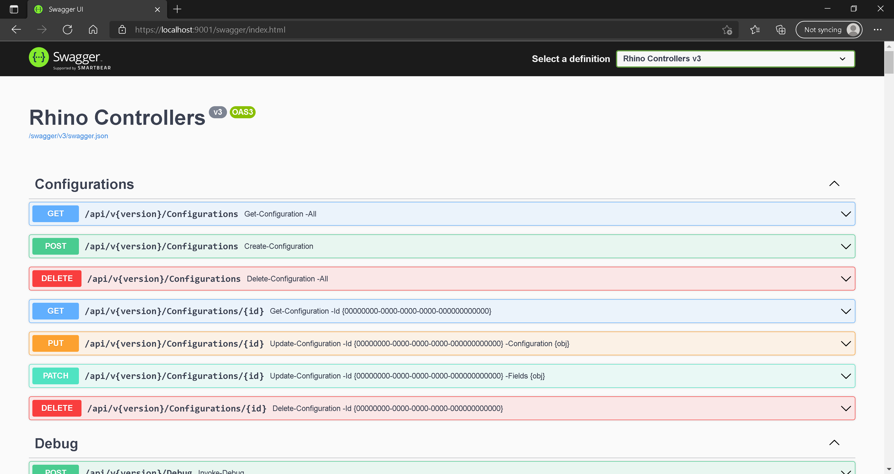

:arrow_backward: [Previous](./07.InstallDockerCompose.md) Unit 8 of 10 [Next](./09.RhinoHealthCheck.md) :arrow_forward:

# Deploy Rhino API, OpenProject Application and Selenoid with Docker Compose
5 min · Unit · [Roei Sabag](https://www.linkedin.com/in/roei-sabag-247aa18/) · Level ★★★★☆

## Pull Browsers Images
Selenoid allows to run automation in parallel using different browsers. The automation runs on a container which is created when the automation starts and disposed when the automation is complete.  

1. Run the following pull commands  

```bash
$ docker pull selenoid/chrome:latest
$ docker pull selenoid/chrome:95.0
$ docker pull selenoid/firefox:latest
$ docker pull selenoid/firefox:93.0
$ docker pull selenoid/opera:latest
$ docker pull selenoid/opera:80.0
$ docker pull selenoid/video-recorder:latest-release
```

## Create browsers.json Configuration File
Selenoid uses a configuration file to map available browsers images to provided capabilities. Please follow these steps in order to create `browsers.json` configuration for Selenoid.  

1. Create a file `browsers.json` under `C:\DockerVolumes\Rhino\Seleniod` for `Windows` or `/app/rhino/selenoid` for `Linux`
2. Copy the following content into `browsers.json` file you have just created.
  
> :information_source: **Information**
> 
> You can add more browsers and versions based on your needs. Check the available browsers for Selenium https://aerokube.com/images/latest/#_selenium. 
  
```json
{
  "chrome": {
    "default": "latest",
    "versions": {
      "95.0": {
        "image": "selenoid/chrome:95.0",
        "port": "4444",
        "path": "/"
      },
      "latest": {
        "image": "selenoid/chrome:latest",
        "port": "4444",
        "path": "/"
      }
    }
  },
  "firefox": {
    "default": "latest",
    "versions": {
      "93.0": {
        "image": "selenoid/firefox:93.0",
        "port": "4444",
        "path": "/wd/hub"
      },
      "latest": {
        "image": "selenoid/firefox:latest",
        "port": "4444",
        "path": "/wd/hub"
      }
    }
  },
  "opera": {
    "default": "latest",
    "versions": {
      "80.0": {
        "image": "selenoid/opera:80.0",
        "port": "4444",
        "path": "/"
      },
      "latest": {
        "image": "selenoid/opera:latest",
        "port": "4444",
        "path": "/"
      }
    }
  }
}
```
  
## Create the Docker Compose YAML
1. Create a file `docker-compose.yaml`.
2. Edit the file with any text editor.
3. Copy the following content into `docker-compose.yaml`.
4. Replace `<host-ip>` (in the `yaml` last line) with your machine IP address.  

### Command Line for Getting IP Address
```bash
# Mac OS
$ ipconfig getifaddr en0

# Windows
$ ipconfig

# Linux
$ ip addr
```

> :information_source: **Information**
> 
> You do not have to create the folder under `volumes` section in advance. Docker will create them for you. Just make sure that you have provided an accessible path (e.g. correct driver letter and access permissions).  

### Windows
```yaml
version: '3'
services:
  openproject:
    image: openproject/community:11
    network_mode: bridge
    environment:
      - SECRET_KEY_BASE=secret
    ports:
      - 8085:80

  rhino:
    image: rhinoapi/rhino-agent:latest
    network_mode: bridge
    depends_on:
      - openproject
    ports:
      - 9001:9001
      - 9000:9000
    volumes:
      - /C/DockerVolumes/Rhino/Outputs:/app/Outputs # You need to provide a vaild local folder.
      - /C/DockerVolumes/Rhino/Data:/app/Data       # You need to provide a vaild local folder.
      - /C/DockerVolumes/Rhino/Plugins:/app/Plugins # You need to provide a vaild local folder.

  selenoid:
    image: "aerokube/selenoid"
    network_mode: bridge
    ports:
      - "4444:4444"
    volumes:
      - "/C/DockerVolumes/Rhino/Seleniod:/etc/selenoid"
      - "/C/DockerVolumes/Rhino/Seleniod/Video:/opt/selenoid/video"
      - "/C/DockerVolumes/Rhino/Seleniod/Logs:/opt/selenoid/logs"
      - "/var/run/docker.sock:/var/run/docker.sock"
    environment:
      - OVERRIDE_VIDEO_OUTPUT_DIR=/C/DockerVolumes/Rhino/seleniod/video
    command: ["-conf", "/etc/selenoid/browsers.json", "-video-output-dir", "/opt/selenoid/video", "-log-output-dir", "/opt/selenoid/logs"]
    ports:
      - "4444:4444"

  selenoid-ui:
    image: "aerokube/selenoid-ui"
    network_mode: bridge
    links:
      - selenoid
    ports:
      - "8080:8080"
    command: ["--selenoid-uri", "http://<host-ip>:4444"]
```  

### Linux
```yaml
version: '3'
services:
  openproject:
    image: openproject/community:11
    network_mode: bridge
    environment:
      - SECRET_KEY_BASE=secret
    ports:
      - 8085:80

  rhino:
    image: rhinoapi/rhino-agent:latest
    network_mode: bridge
    depends_on:
      - openproject
    ports:
      - 9001:9001
      - 9000:9000
    volumes:
      - /app/rhino/outputs:/app/Outputs # You need to provide a vaild local folder.
      - /app/rhino/data:/app/Data       # You need to provide a vaild local folder.
      - /app/rhino/plugins:/app/Plugins # You need to provide a vaild local folder.

  selenoid:
    image: "aerokube/selenoid"
    network_mode: bridge
    ports:
      - "4444:4444"
    volumes:
      - "/app/rhino/selenoid:/etc/selenoid"
      - "/app/rhino/selenoid/video:/opt/selenoid/video"
      - "/app/rhino/selenoid/logs:/opt/selenoid/logs"
      - "/var/run/docker.sock:/var/run/docker.sock"
    environment:
      - OVERRIDE_VIDEO_OUTPUT_DIR=/app/rhino/selenoid/logs
    command: ["-conf", "/etc/selenoid/browsers.json", "-video-output-dir", "/opt/selenoid/video", "-log-output-dir", "/opt/selenoid/logs"]
    ports:
      - "4444:4444"

  selenoid-ui:
    image: "aerokube/selenoid-ui"
    network_mode: bridge
    depends_on:
      - selenoid
    links:
      - selenoid
    ports:
      - "8080:8080"
    command: ["--selenoid-uri", "http://<host-ip>:4444"]
``` 

5. Save the file.

## Run Docker Compose Command
1. Open a `command line`/`bash`/`terminal` on the location where you have created the `docker-compose.yaml` file.
2. Run the following command:  

```bash
docker-compose up
```  

3. Run the following command to test the SUT (system under test) deployment.  

```bash
docker ps
```  

  
_**image 1.1 - Containers List**_

## Check Rhino API Availability
1. Open any Web Browser.
2. Navigate to `https://localhost:9001/swagger` address.

_**At this point Rhino Open API page opens**_

  
_**image 1.2 - Open API Page**_  

---
### Next Unit: Run Rhino API health check to verify the Rhino API deployment
### [Continue](./09.RhinoHealthCheck.md) :arrow_forward:
---
