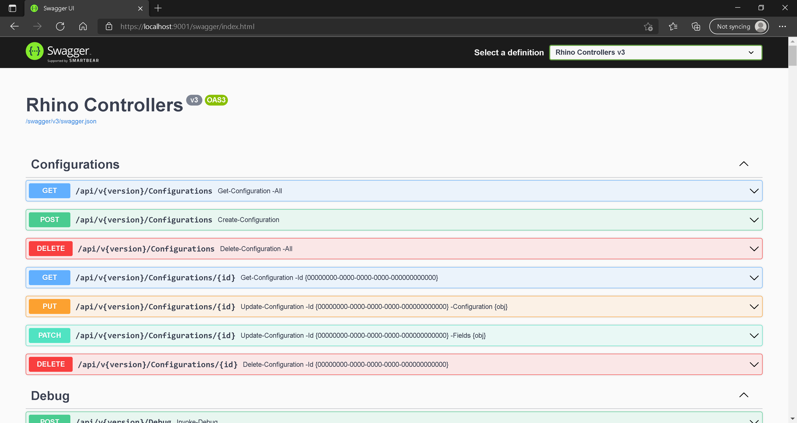

:arrow_backward: [Previous](./05.ServerSettings.md) Unit 6

# Rhino API - Verify Deployment
2 min · Unit · [Roei Sabag](https://www.linkedin.com/in/roei-sabag-247aa18/) · Level ★☆☆☆☆  

1. Open any Web Browser.
2. Navigate to `https://localhost:9001/swagger` and/or `http://localhost:9000/swagger` address.

_**At this point Rhino Open API page opens**_

  
_**image 1.2 - Open API Page**_  